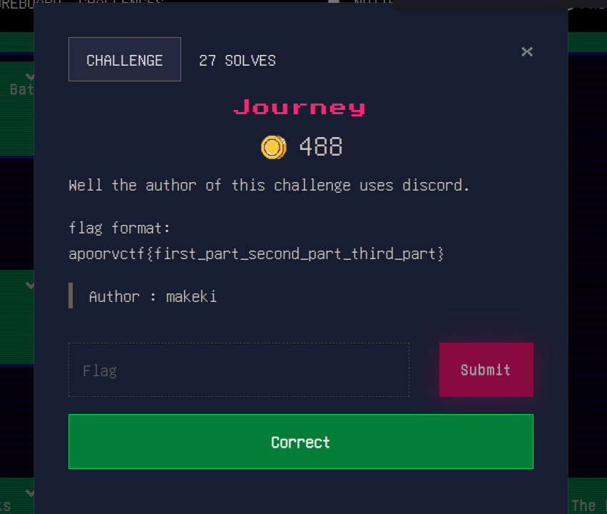

As a web player. I am naturally drawn to highly technical challenges that involve
reading the HTML spec for hours to find that one behavior where mutation XSS can occur,
it's the content of my blog for the most part. However, I'm taking a step to explore
other areas of cybersecurity, most notably, I see that osint is a ctf category that can't
be AI slopped (yet?), and so the dopamine I get from solving a challenge still hits like the
old days, i.e. BC (before gpt lol).

## How it starts

I started with looking up the name `makeki` on discord. It's our first clue anyway.
Funny enough, participants had already changed their usernames to be `makeki` (including myself btw lol),
but it wasn't hard to figure out the author based on their discord role:

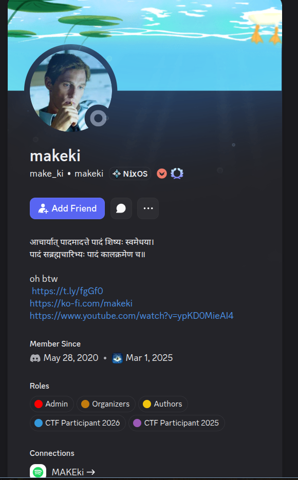

In every investigation I carry (look at me haha, calling myself investigator and stuff), I
like to keep an **info.md** file that I use to gather data about my target. Once
I feel like I've drained my resources for data, I take a step back to analyze
the data and connect the dots, so consider creating that file and writing down
every information about our target. I'll mention what's there about makeki, but will only
detail the path towards a solution so that the writeup stays of manageable size.

## Diving into discord

The first step I took was translating the text in hindi to find that it was a religious
verse of some kind. After that, I checked the links in the bio to see where they point to.
Here's our first find:

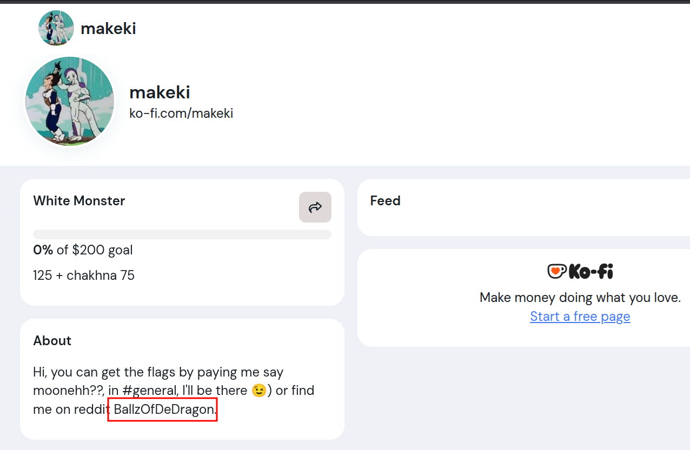

Looking up the username on reddit leads to [this](https://www.reddit.com/user/BallzOfDeDragon/) profile
which has a clear indication that it has something to do with makeki:

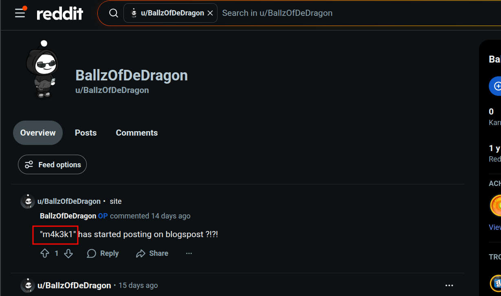

At this point, whenever I see a leet encoded string that looks like a username. I always
run it through [sherlock](https://github.com/sherlock-project/sherlock) to see what I get,
in the meantime, I read every single post *BallzOfDeDragon* wrote to uncover further information:

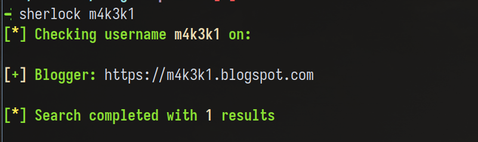

My notes of the posts:

* [x] rickroll qrcode (obviously lol)
* [x] "m4k3k1" has started posting on blogspost ?!?!
* [ ] I remember spending time playing roblox, my account quantumking345 well... (no spoilers)
* [ ] was this bruteforceable? anyways it was easy... (no spoilers)
* [ ] Seed basket, wormwood, basket basket, basket basket, basket basket...
* [ ] ?? the trav post i don't understand ??
* [ ] random post yapping about college?

Good, those are lots of information. As you can see by the `[ ]` todo list approach I'm having,
I'll check every single info down this list for further details about our target. I already
discovered makeki has a blogspot, which will take a long time to read, so I took my time
with the reddit account info to see what I can get.

## Vegeta in the files?

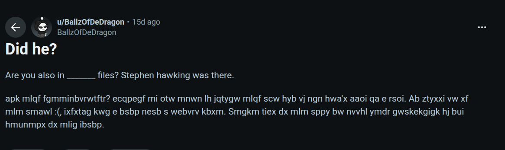

This was definitely a cipher. From my time in cryptohack, I learned about [this](https://www.dcode.fr/cipher-identifier)
which helps identify which cipher we're using. It turns out it's vigenere:

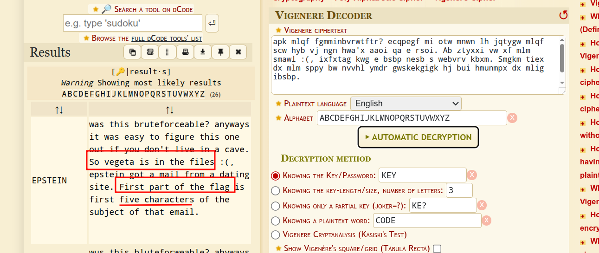

There we go. Just go [here](https://www.justice.gov/epstein), lookup the word vegeta and get the
first part: `gggeb`

## Communities in Roblox

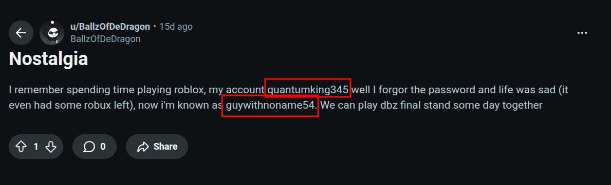

I needed a vpn for this step (guess who blocked roblox in his country~), and admittedly,
this part was somewhat guessy (although everything in life is, so wouldn't fault the author anyway). At first,
I had zero experience with the roblox ecosystem, but as I spent some time there, I noticed
the game final stand didn't show in either accounts. Interestingly, quantumking345 has a friend with
an eerily similar name: quantumking456

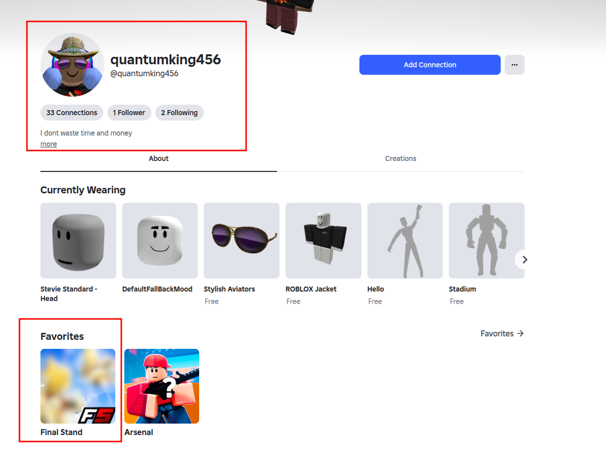

I also saw that quantumking456 was part of a community who had small members, which
is always a sign of a friend hangout:

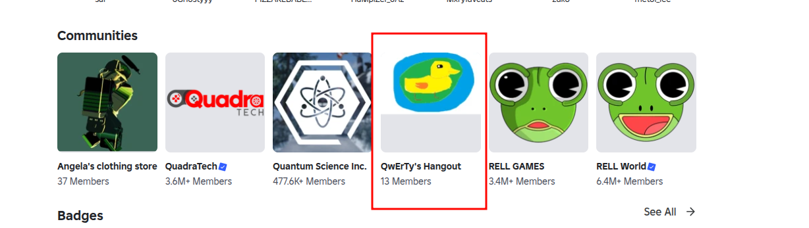

Another username?

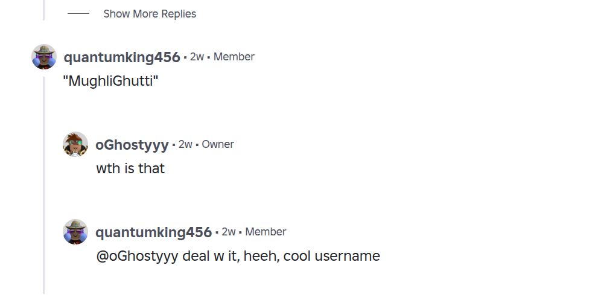

Let's run through sherlock and see.

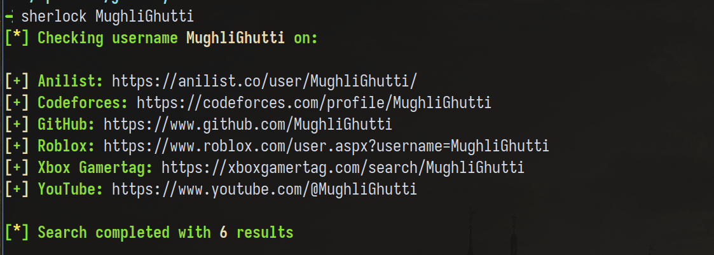

This wasn't a big list, and the site codeforces stands out the most (guywithnoname54 had a codeforces account, but it was locked,
that's what gave it away for me). When you go there, you see an account with a QR Code as a profile picture (weird innit~)

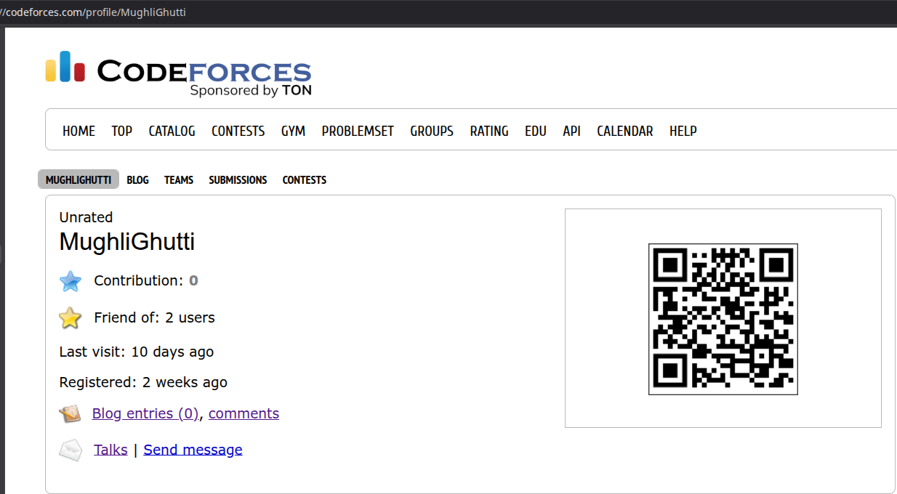

Decode it, and find a youtube video [link](https://youtu.be/tg8Jahz6RM4?si=BYwrNR0vlY9GVXLi). Check the latest comments and see:

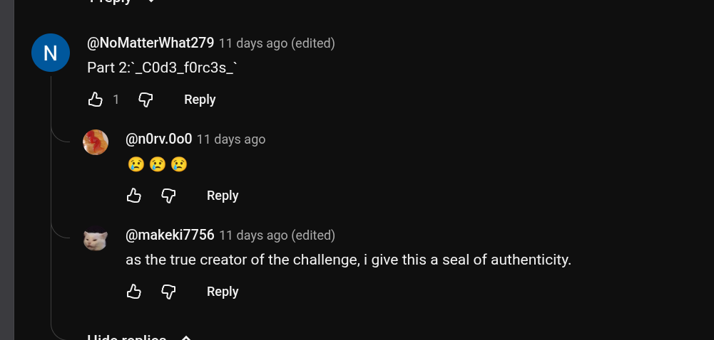

Part 2 is `_C0d3_f0rc3s_`.

## The hike

At this point, I was done with the reddit path and the only thing that remained was the blogspot
from earlier, I checked it out, and this base64 encoded string stood out to me:

```
aWYgeW91IGFyZSBsb29raW5nIGZvciBhIGZsYWcgaGVyZSwgY29uZ3JhdHMuIFRoZSBsYXN0IHBhcnQgb2YgdGhlIGZsYWcgaXMgdGhlIG1vYmlsZSBudW1iZXIgKDEwIGRpZ3RzKSBvZiB0aGUgc3RheSB3ZSBzdGF5ZWQgYXQuIFlvdSBjb3VsZCBmaW5kIGl0IG9uIHRoZSBzb2NpYWxzIG9mIHRoYXQgc3RheS4

which decodes to:
if you are looking for a flag here, congrats. The last part of the flag is the mobile number (10 digts) of the stay we stayed at. You could find it on the socials of that stay.
```

This was a clear indication that we needed to read the blog post and track where makeki
and his friends stayed for the night of the journey (hence the challenge name). I did read
the blog post, and to be honest, good writing! But I wanna take a different approach: Geolocating the image.

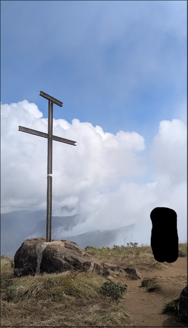

Using a raw reverse image search on this picture won't work, you can try and see for yourself,
so I'll share a cool neat trick to improve our accuracy.

First, I fed the image to gemini and asked it to remove the black rectangle from the image and complete the pattern to widen the image,
then, I asked it to read the blog post and give the general location makeki was at, which was Munnar, Kerala, India.

With those 2 information in mind, reverse image search this image,

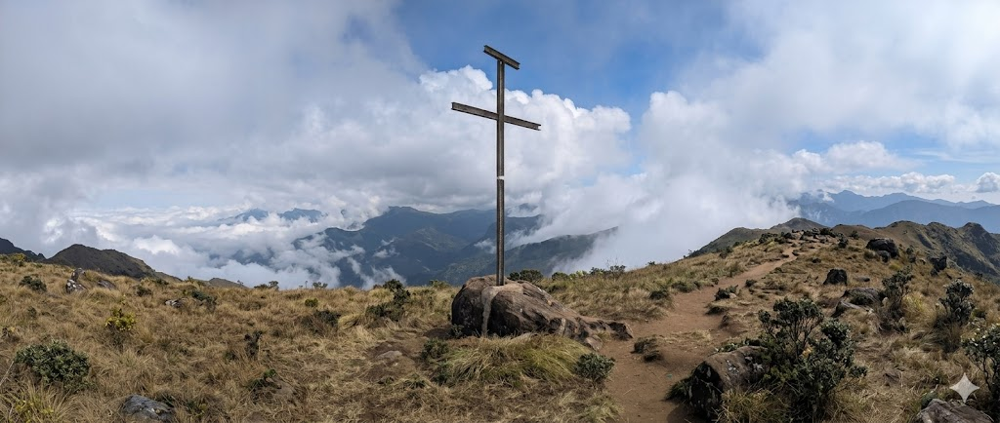

with the kerala text,

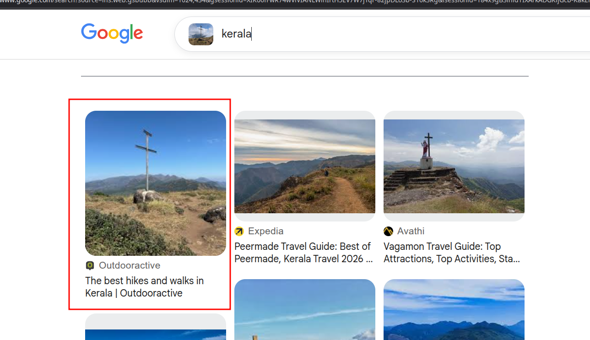

to find the location they were at.

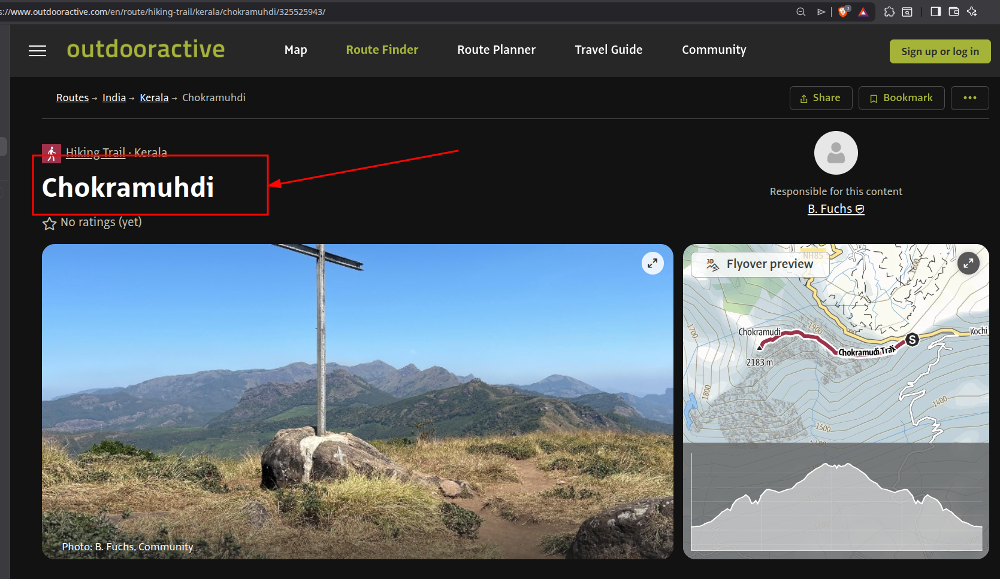

All we have to do now is use the base of the hiking trail as an anchor and see how much we're far from the stay. Gemini says this:

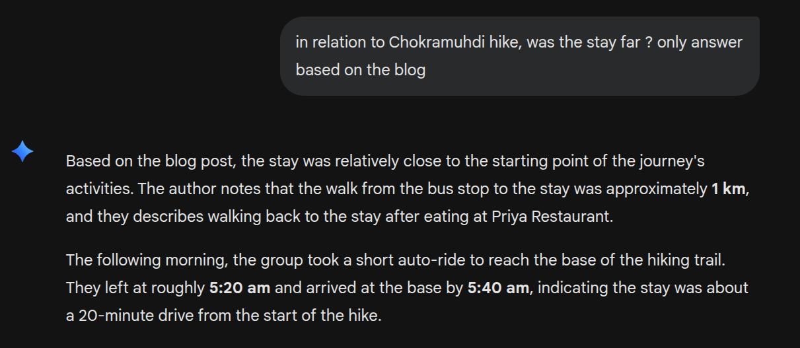

So logically, we just have to follow the road connected to the base of the hiking trail, check
to see any homestays along the way (This is the starting point btw: `10°02'10.7"N 77°07'21.9"E`), luckily
for me, every hotel/stay I saw taking the right path were 3 to 4-star hotels, which I'm guessing
is beyond the financial power of young students (Well, It's beyond me, that's why I say the same to my fellow makeki guys),
so I took the left turn instead

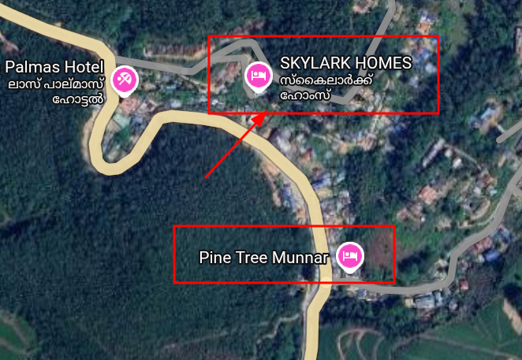

> If you read the blog, you actually find out about the pine tree Restaurant shown in the map,
> so we're definitely on the right track. Also, reading the blog reveals makeki and his friends took a right turn in a muddy road
> to reach the stay, so misty hills is out of the question too. Damn, reading the blog came in handy after all

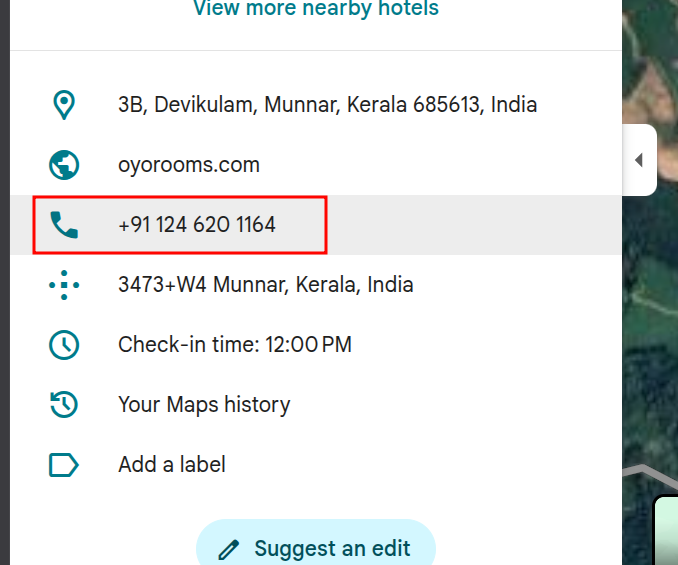

The third part is: `911246201164`

## Bringing it all together

Having known all of this. The flag becomes: `apoorvctf{gggeb_C0d3_f0rc3s_911246201164}`

Fun, instructive challenge that I really enjoyed


