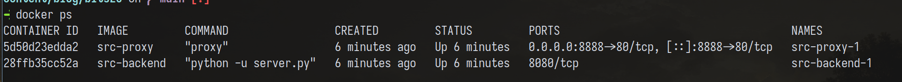
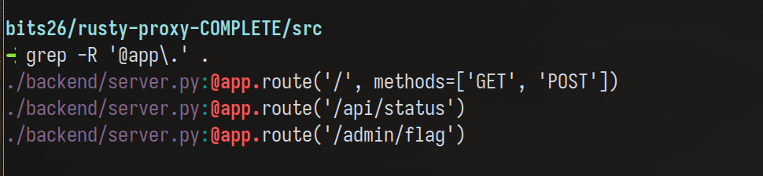
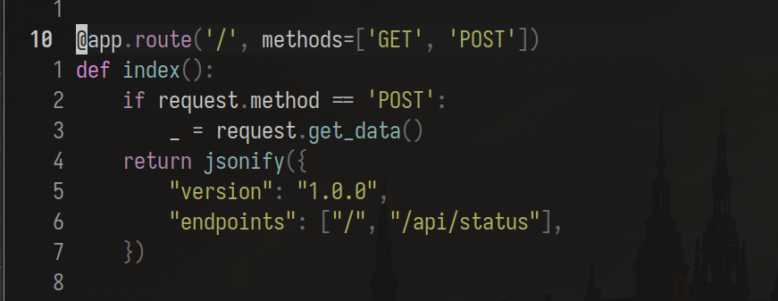
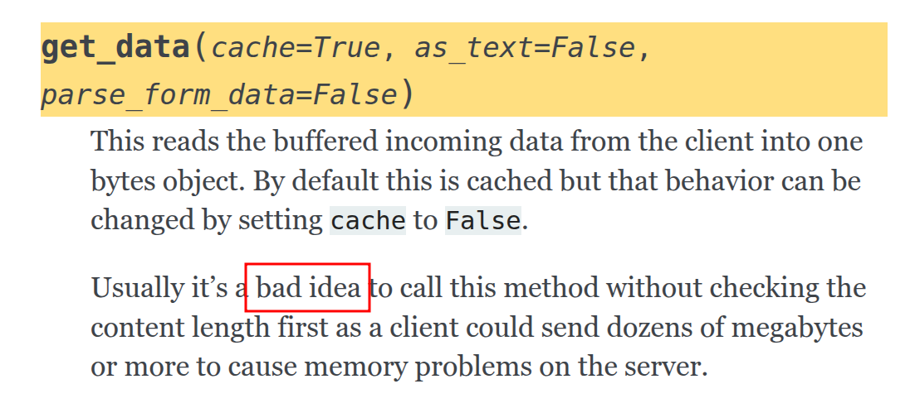
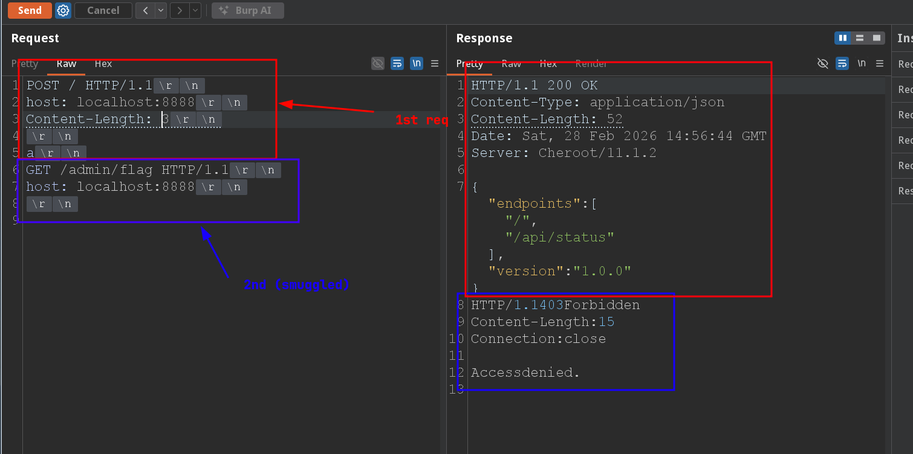
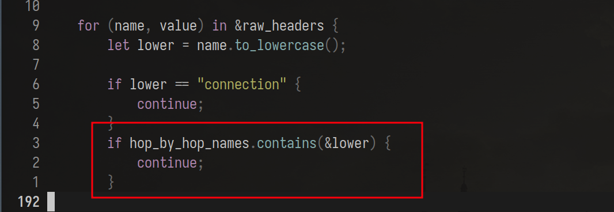
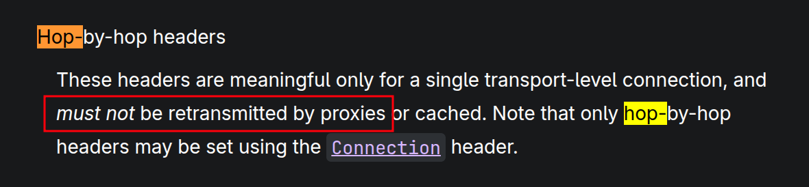
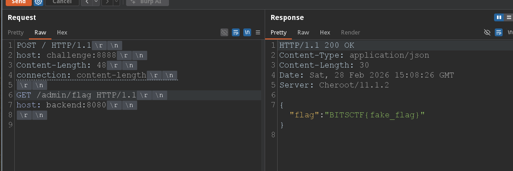

## Introduction

Last weekend, I played bits ctf with my friends from vuln3ra, it was a special experience
that featured the use of "lwld", which in arabic translates to the "boy"? Anyways, it was
a name we called our AI agents.

Pretty much everything was solved using lwld, with the exception of few challenges among
which was one that required setting up a cloudflare worker to initiate requests from
cloudflare's network. I took upon myself the task of solving web challenges manually
with minimal AI interference. It turns out that many of the challenges I solved were well thought
and featured a lot of great ideas. In this blog post, I will walk you through how I found the vulnerabilities
in these challenges, and what my thought process was when solving, with some interesting
notes and reference points in case you wanna further read about the vuln.

I'm new to this style of writing, if you follow me so far, you'll notice that I'm pretty
structured, with headers splitting the writeup into isolated chunks you can read indepenedently.
This time however, I'll solve the challenges as I write this, and my main goal is to make
you aware of the techniques used to uncover the vuln, rather than walk you through each and every
step towards the flag. Hope you enjoy!

## Rusty Proxy [1st one]



This challenge was very simple. We have two services running, a reverse proxy and a backend that handles our requests.
The job of the proxy is to forward our requests from us to the backend and vice versa.

```bash
.
├── backend
│   ├── Dockerfile
│   ├── requirements.txt
│   └── server.py
├── docker-compose.yml
└── proxy
    ├── Cargo.toml
    ├── Dockerfile
    └── src
        └── main.rs

4 directories, 7 files
```

The first thing I do when analyzing source on my own is first checking the Docker files,
after that, I usually grep for endpoints using `grep -R '@app\.' .` or such to see what
sources are available to us.

Sources, in case you don't know is the entrypoint us attackers use to exploit applications,
the only way we can affect an app is if we send it a request. Requests map to different
endpoints on the backend, and that's our source.



As you can see, we have 3 endpoints:

1. `/api/status` which acts as a sanity check that the server is running
2. `/` which interesting accepts both GET and POST (all other only do GET)
3. `/admin/flag` I'm assuming gives the flag (we can't call this directly)

It should be obvious what our goal is: Smuggle a request to `/admin/flag`.

---

Previously, I said we want to affect the server and exploit it, we do that by sending
our own custom data. If you're familiar with HTTP verbs, you know that POST
allows us to send data to the server for processing (not that others don't, but semantically, GET is for retrieval only).

Let's check what we can pass.

> TIP: add `-n` to grep to see which line the endpoint function is defined



If the method is POST, we `get_data()`.

I don't know what get_data does, so simply, I reach for the docs (Read the friendly manual guys~) and
learn. How do I reach for the docs you ask? I simply check what library does get_data come from
and follow it. In our case, get_data is a method of `request` which comes from the flask package.



See? We have a hint here, the word "bad idea" usually never hints at something good.
Reading the documentation further, we understand that data coming from a client into a bytes object
(it doesn't matter what the function stores data in). It says that you shouldn't call
this function without checking the 'Content-Length' first as the client can supply
HUGE data causing memory corruption issues.

Our goal though isn't to corrupt the memory, it's to send a request that gets treated
as two, so how can I use the info from the docs to smuggle another request? Is the question I ask myself.

## Experimentation

At this point, I identified a sink, a term we call dangerous functions that can have weird
behavior. Consider the following:

* get_data warns us about checking the content-length. We know that we can set this
header to whichevery value we want, what if we set it to 0 BUT send more than 0 bytes of data
in the body, such that it gets treated as another request? Let's try:



Access denied :(

The proxy is blocking us, if you check the code, you'll see that it delimits requests based on
content-length. If you specify 3 as content-length, the proxy will see 2 separate requests from the get go,
one in blue and the other in red.

---

If I were to approach this challenge blindly, I would've tried the typical content-length
and transfer-encoding tricks, but since we have the source, I just read it, and here's what I found:

> Ref: James kettle has AMAZING video series about HTTP request smuggling btw, you should check them out.



The proxy was manually parsing our requests. Everything was according to the RFC (don't quote my RFC knowledge lol),
only one thing stood out to me the most: The "Hop By Hop" term.

Again, we read the docs:



The doc basically says that if we have a connection header whose values (comma separated btw) contain
other header names, then the proxy should NOT forward these headers to the backend.

See the vuln here? Let me show you:

If you send a request whose body contain another request and set the Content-Length to be the
size of the smuggled request, the proxy will forward the whole thing to the backend,
but with the added knowledge that `Connection: Content-Length` will prevent the length
to be transmitted, we guarantee that the backend only reads the headers, and thinks
of the body as a **new request** that needs handling. Just like this:



We get the flag: `BITSCTF{tr4il3r_p4r51n6_15_p41n_1n_7h3_4hh}`

## Takeaway

Always be methodical when analyzing stuff and take a question based approach, it does work!
