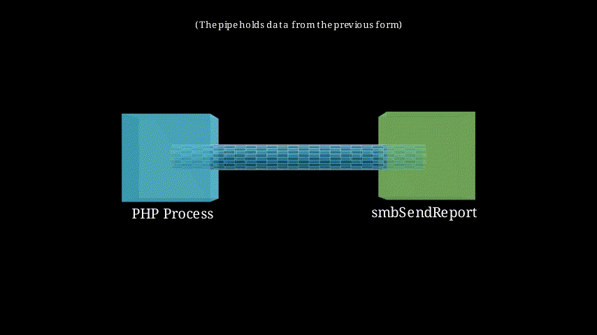
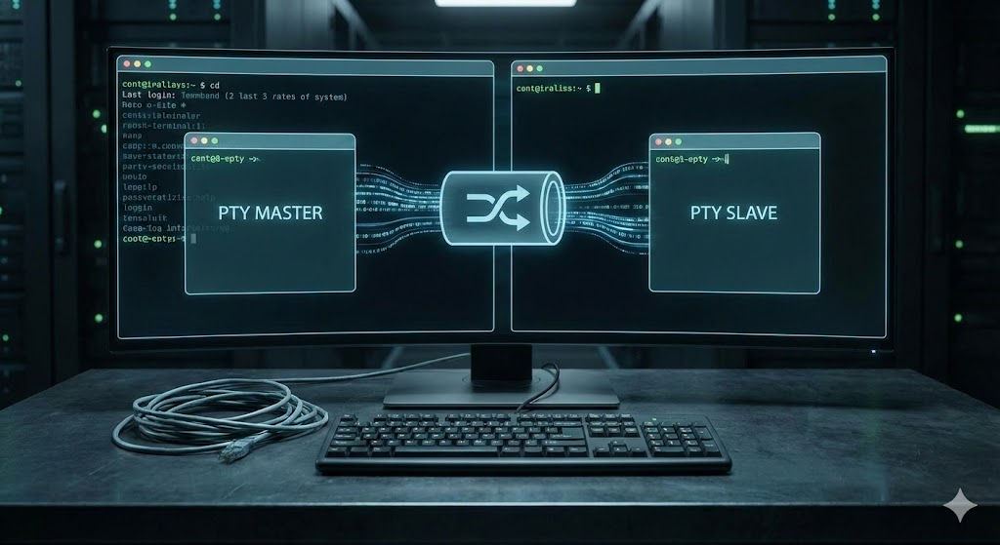

## TL;DR

I bypassed the PHP `substr` sanitization to send an oversized payload to an `expect` script wrapping `smbclient`.
By flooding `smbclient` with more data than its legacy 1024-byte password buffer could accept,
I forced the excess characters to remain floating in the Pseudo-Terminal (PTY) input queue.
When `smbclient` either failed authentication or dropped to a prompt, it (or the parent shell) immediately consumed those "leftover" bytes as the next command, resulting in Unauthenticated Remote Code Execution.

## Challenge Overview

* CTF: BSides Algiers 2025
* Challenge: Expect
* Category: Web
* Points: 400-ish (had around 7 solves last time I checked)
* Description: ?
* Author: [souad]()
* Attachments:
    * [expect.zip](https://github.com/Shellmates/BSides-Algiers-2025-challenges/blob/main/web/expect/expect.zip)

## Introduction

In the recent BSides Algiers CTF 2025 (we secured top place btw~), there was this web challenge
I couldn't solve during the CTF, but was eager to attempt afterwards. It featured a tool
called `expect` that served as a tool to automate interaction between a user and the terminal.
As we'll see, this wording of user and terminal is slightly inaccurate, and the knowledge of how terminals
work will prove useful to solve this challenge.

## Context & First Impressions

<video
  controls
  autoplay
  loop
  muted
  playsinline
  style="max-width: 100%; border-radius: 8px;">
  <source src="/videos/expect-showcase.mp4" type="video/mp4">
  Your browser does not support the video tag.
</video>

As you can see, the web app connects our SMB server, and pushes a dummy pdf file to our
share. You might have noticed that I padded the password by a 100 As before typing the actual password
and that's due to the way the web app handles our password:

```php
    $sharePwd = substr($_POST["password"], 100);
```

Where it returns only part of the password starting from the 101th character.

Interesting behavior, when solving the challenge, I remembered the famous buffer overflow, not in its memory corruption sense though.
I wasn't sure how this can prove useful, but I registered it as potential asset anyway.

## Threat Model

Since the UI doesn't give away much information, I dove into the source code of the application:

```bash
web-expect/
├── docker-compose.yml
├── Dockerfile
├── dummy_report.pdf
├── flag.txt
├── smbSendReport
└── src
    ├── index.php
    └── static
        ├── bootstrap.css
        └── stylesheet.css

3 directories, 8 files
```

We can see the dummy pdf file at the root of the challenge directory, it became obvious
that I needed to make the server send me the flag file.

Other than the fluff (docker files and CSS), two files actually mattered:

1. `index.php`, and
2. `smbSendReport`

Let's take a look at them.

---

### 1. `index.php`

```php
<?php
$TEST_FILEPATH = "./dummy_report.pdf";

if (isset($_POST["service"]) && isset($_POST["dst_path"]) && isset($_POST["username"]) && isset($_POST["password"])) {
    $shareDomain = $_POST["service"];
    $dstPath = $_POST["dst_path"];
    $shareLogin = $_POST["username"];
    $sharePwd = substr($_POST["password"], 100);
    $timestamp = date(DATE_ATOM);

    $vals = [
        'service' => base64_encode($shareDomain),
        'username' => base64_encode($shareLogin),
        'command' => "put \"$TEST_FILEPATH\" \"$dstPath-$timestamp\"",
        'password' => $sharePwd
    ];

    $descriptors = [
        0 => ["pipe", "r"],
        1 => ["pipe", "w"],
        2 => ["pipe", "w"]
    ];

    $process = proc_open("/usr/local/bin/smbSendReport", $descriptors, $pipes);

    if (is_resource($process)) {
        foreach ($vals as $val) {
            fwrite($pipes[0], "$val\n");
        }

	// for debug
	//$stdout = stream_get_contents($pipes[1]);
	//var_dump($stdout);

        $exitCode = proc_close($process);

        if ($exitCode !== 0) {
            $success = false;
            $result = "An error occured";

        } else {
            $success = true;
            $result = "File uploaded sucessfully";
        }

    } else {
        $success = false;
        $result = "An error occured";
    }
}
?>
```

The script first takes input from the user, then passes that input to the `smbSendReport` process
via its standard input. This essentially mimics a pipe situation in a command like:

```bash
echo 'hello world' | smbSendReport
```

The specifics of how this passing of data occurs is beyond the scope of this writeup, although
you can take a look at [this video](https://www.youtube.com/watch?v=rW_NV6rf0rM) which explains
the underlying concepts behind this. Here's an animation of how this happens (we'll need these visualizations drilled down moving forward):



### 2. `smbSendReport`

```tcl
#!/usr/bin/expect

set timeout 2

set service [gets stdin]
set username [gets stdin]
set command [gets stdin]
set password [gets stdin]

set env(PS1) "> "
set prompt $env(PS1)

cd /var/www/reports/

spawn bash --noprofile --norc

expect {
    -re $prompt { send "smbclient -U \"\$(echo $username | base64 -d)\" \"\$(echo $service | base64 -d)\"\n" }
    timeout {puts "An error occured"; exit 1;}
    eof { exit 1 }
}

expect {
	-re "Password .*:" { send "$password\r" }
	timeout {puts "An error occured"; exit 1;}
}

expect {
	"smb: *\>" { send "$command\r" }
	timeout {puts "An error occured"; exit 1;}
}

expect {
	"putting file .*" { send "quit\r"; exit 0; }
	timeout {puts "An error occured"; exit 1;}
}

interact
```

This one is an **[expect](https://linux.die.net/man/1/expect)** script. Expect is a
program that automates interactive terminal applications (smbclient in our case). It takes
input from its stdin, which we're passing data to from the php process and spawns bash to automate the interaction with.

Expect works matchings *patterns* based on the spawned process output, when:

1. The shell first spawns, it writes "`> `" to its stdout. In that case, the first expect block fires:
```tcl
expect {
    -re $prompt { send "smbclient -U \"\$(echo $username | base64 -d)\" \"\$(echo $service | base64 -d)\"\n" }
    timeout {puts "An error occured"; exit 1;}
    eof { exit 1 }
}
```
It takes the username and service from standard in, base64 decodes them and runs the `smbclient`
command to connect to our smb server.

2. We are prompted for a password, we supply the password read from stdin:
```tcl
expect {
	-re "Password .*:" { send "$password\r" }
	timeout {puts "An error occured"; exit 1;}
}
```

3. We establish a successful connection with the smb server, i.e. "`smb: \> `" printed, we send a command,
again read from stdin into the command variable to be executed in the smb session.
```tcl
expect {
	"smb: *\>" { send "$command\r" }
	timeout {puts "An error occured"; exit 1;}
}
```

The only problem that's preventing us from exfiltrating the flag file is the fact that
the first argument in the command string is always the dummy pdf:
```php
        'command' => "put \"$TEST_FILEPATH\" \"$dstPath-$timestamp\"",
```
Also, trust when I say, I looked for a million ways to have two commands execute in the same line,
but none were found.

> Note: Expect uses a language called TCL, you can read about it [here](https://en.wikipedia.org/wiki/Tcl_\(programming_language\))

Since the code logic itself seemed secure, I realized the vulnerability might not be in the PHP or Tcl code, but in the medium through which they communicate: the Linux TTY subsystem.

## TTYs and PTYs

Remember when I said that automating interaction between a user and the terminal is an inaccurate
term, it turns out that expect automates your interaction with the *bash* shell (by extension the *smbclient*),
using what we call a pseudo-terminal.



As the picture shows, a pty is simple a data channel between 2 parties: expect and bash.

Expect, being the commander or the automator of the interaction controls its slave by sending
it data through the PTY master, which is simply a file that can be written to (every in linux is a file btw~).
Bash then reads from the PTY slave (a file also) as if it's reading input from you typing on your keyboard.
I won't go into much details in this, because [the work has already been done for me](https://www.linusakesson.net/programming/tty/), rather,
I will tie the challenge to this concept:

Because the PTY slave and master are both files, we can read from and write to them,
linux identify these files using [file descriptors](https://www.youtube.com/watch?v=rW_NV6rf0rM). Expect
uses this construct to identify the PTY master and writes to it, the pipeline in the middle (between the PTY master and slave)
then carries this data to the slave, waiting to be read from. Bash comes and reads from the PTY slave, effectively consuming
the data.

> It should be noted that multiple processes can attach themselves to the PTY slave,
> and linux would control which ones access and the PTY and when. This is called **job control**

Here's a live illustration of this write -> read process:

<video
  controls
  autoplay
  loop
  muted
  playsinline
  style="max-width: 100%; border-radius: 8px;">
  <source src="/videos/pty-rw.mp4" type="video/mp4">
  Your browser does not support the video tag.
</video>

---

Having known the process by which data transfers between the automator (expect) and the
automated (bash), we note that data needs to be consumed by the slave process before
it gets used by it. More specifically, in our case:

1. Expect's spawn creates a PTY.
2. Bash attaches itself to the PTY as a slave
3. Bash reads from the PTY the *smbclient* command.
4. Bash launches the smbclient as a child process,
5. *smbclient* now controls the PTY and can write/read from it.

This begs the question: What happens when *smbclient* refuses to read all the data
from the PTY slave and closes itself? What happens to the remaining data in the buffer?

### Bash's event loop

To answer the case mentioned above, we take a look at bash's [source code](https://github.com/gitGNU/gnu_bash/blob/bc007799f0e1362100375bb95d952d28de4c62fb/lib/readline/examples/excallback.c#L128):

```c
int
main()
{
    fd_set fds;

    // irrelevant code...

    while(1) {
      FD_ZERO(&fds);
      FD_SET(fileno(stdin), &fds);

      if( select(FD_SETSIZE, &fds, NULL, NULL, NULL) < 0) {
        perror("select");
        exit(1);
      }

      if( FD_ISSET(fileno(stdin), &fds) ) {
        rl_callback_read_char();
      }
    }
}
```

The code above monitors the shell's standard input (which is tied to the PTY remember),
and waits for changes of the type "is there input?" to the kernel, if there is, i.e. PTY slave has data, bash reads it and processes it.

This should answer the question: If smbclient quits without reading all the buffered
data, the remaining one gets consumed by bash and treated as input, input in bash means commands,
commands mean RCE!

## Exploitation

Now that we know the mechanism by which we get RCE, I'm simply too tired to dig the smbclient's
source code and find out how much data I need to do to overflow the password prompt and get my command to run,
in the video, I did 1024 bytes + my command and it worked (neatly so wow):

<video
  controls
  autoplay
  loop
  muted
  playsinline
  style="max-width: 100%; border-radius: 8px;">
  <source src="/videos/overflow-smbclient.mp4" type="video/mp4">
  Your browser does not support the video tag.
</video>

Good, let's do this through the web application, just bare in mind the line of code:
```php
    $sharePwd = substr($_POST["password"], 100);
```
which takes the strings starting at index 100, so we need to add a 100 character to our payload

With that said, let's git that flag shall we:

<video
  controls
  autoplay
  loop
  muted
  playsinline
  style="max-width: 100%; border-radius: 8px;">
  <source src="/videos/flag-intended.mp4" type="video/mp4">
  Your browser does not support the video tag.
</video>


## Bonus (unintended, but instructive!)

When I was researching the topics of TTYs and PTYs, I found out about a very interesting
component that sits between the writing and consumption of data from the PTY channel. It's called **the line discipline**.

Terminals can operate in two modes: *cooked **Or** raw*, the second one is out
of the scope of this writeup (you can read about it [here](https://www.linusakesson.net/programming/tty/) though), but the cooked
mode, which is the default mode of operation for terminals has the idea that slave processes
shouldn't consume PTY data immediately, as users might make mistakes and intend on correcting them

> I'm sure you had a time where you pressed backspace to delete a mistyped character haha~

This component, which sits at the [`n_tty.c`](https://github.com/torvalds/linux/blob/master/drivers/tty/n_tty.c), has a function
called [`n_tty_receive_buf_standard`](https://github.com/torvalds/linux/blob/master/drivers/tty/n_tty.c#L1547) which checks
if the user types a control character (backspace...etc) to correct a mistake. Correcting a mistake
means the kernel erases the undesired data from the *kernel read buffer*.

This is awesome! Having known this, we can just connect to our smb server normally, set the destination
path to a LOT of backspaces (ironically, we can even do Ctrl-A Ctrl-K) to erase the naive dummy command,
and instead send us the flag file.

The solve for this can be an exercise for the reader as homework to do (or for when I'm less busy to record a solve).


## Lessons learned

* **PTYs are State Machines, not just Pipes:** Unlike standard pipes which act as simple data conduits, PTYs implement complex behaviors via the Line Discipline. Data left unread by one process isn't discarded; it persists in the buffer for the next active process to consume.
* **Legacy Constraints still haunt us:** Many standard Unix utilities (`smbclient`, `su`, `sudo`) still enforce archaic buffer limits (often 128 bytes) when reading passwords from a TTY. Knowing these magic numbers is crucial for overflow attacks.
* **"Expect" is Fragile:** Automation scripts like `expect` rely on string parsing and assume the child process behaves perfectly. They rarely handle edge cases like partial reads or buffer overflows, making them prime targets for injection attacks.
* **The Kernel is the ultimate arbiter:** The "Bonus" solution (using backspaces) reveals that data manipulation can happen inside the kernel (`n_tty_receive_buf_standard`) before the application ever sees it. Understanding kernel drivers can turn a "web" challenge into a "binary" exploitation path.
* **Read the Man Pages (and Source):** The breakthrough came not from fuzzing, but from reading the `bash` event loop source code and understanding `select()`. Deep knowledge of how tools wait for input is often more powerful than blind payload testing.

## References

1. [\[video\] History For Hire Video - Teletype](https://www.youtube.com/watch?v=I_O-KlHhkII)
2. [\[video\] Reviving a Model 43 Teletype](https://www.youtube.com/watch?v=zeL3mbq1mEg)
3. [\[video\] What’s a TTY? (And Why Linux Still Thinks It’s 1970)](https://www.youtube.com/watch?v=J7utkbl0mWw)
4. [\[article\] The TTY demystified](https://www.linusakesson.net/programming/tty/)
5. [\[video\] How Linux Kernel Prints Text on Screen](https://www.youtube.com/watch?v=aAuw2EVCBBg)
6. [\[video\] How Do Linux Kernel Drivers Work? - Learning Resource](https://www.youtube.com/watch?v=juGNPLdjLH4)
7. [\[video\] Unix terminals and shells](https://www.youtube.com/watch?v=N8kT2XRNEAg&t=60s)
8. [\[video\] What's behind a file descriptor in Linux? Also, i/o redirection with dup2.](https://www.youtube.com/watch?v=rW_NV6rf0rM)
9. [\[article\] Build with Naz : Explore Linux TTY, process, signals w/ Rust](https://developerlife.com/2024/08/20/tty-linux-async-rust/)
10. [\[article\] The TTY Layer](http://marcocorvi.altervista.org/games/lkpe/tty/tty.htm#:~:text=The%20TTY%20layer,an%20array%20of%20control%20characters)
11. [\[article\] Linux Device Drivers, Third Edition](https://lwn.net/Kernel/LDD3/)
12. [\[video\] A Gentle Introduction to BPF using bpftrace](https://www.youtube.com/watch?v=-JxEUKE--RA)
13. [`n_tty_receive_buf_standard`: Where the Check for Control Characters Appears](https://github.com/torvalds/linux/blob/master/drivers/tty/n_tty.c#L1547)
14. [Bash Main Event Loop: It asks the Kernel, "Does File Descriptor 0 (stdin) have any bytes waiting for me?](https://github.com/gitGNU/gnu_bash/blob/bc007799f0e1362100375bb95d952d28de4c62fb/lib/readline/examples/excallback.c#L128)
